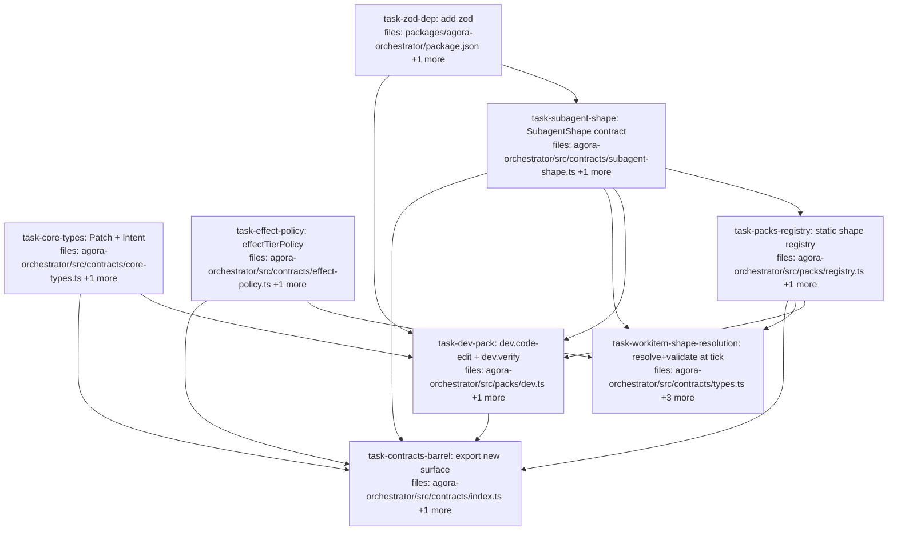

## Context

PR5 of the orchestrator ladder: the **dev pack + SubagentShape** rung (spec:
`docs/superpowers/specs/2026-05-28-agora-orchestrator-design.md` §1–§4). Turns the
orchestrator from "dispatch opaque `subagent` strings" into "dispatch typed,
schema-validated work shapes." Builds on the shipped skeleton (registries, core
types, `EffectTier`) and the dispatch-executor (PR3). The secret substrate
underneath is now solid (PR4a/PR4b merged).

**Scope (what PR5 delivers):**
- `SubagentShape` contract — `{ id, effectTier, inputSchema, outputSchema, capability }`.
- A static **packs registry** with construction-time duplicate-id + field validation (D8).
- A **dev pack** contributing `dev.code-edit` (write-impure) and `dev.verify` (read-impure).
- `WorkItem` gains an optional `subagentShape` id; the **tick resolves the shape, validates `inputs` against `inputSchema` at the boundary, and reads `effectTier`**.
- **effectTier is declared on every shape, validated at registration, and read by the policy engine** (`effectTierPolicy`) — the user-requested fold-in.

**Decisions baked in (flag on review if you disagree):**
- **Schema lib = `zod`** (the spec allows "Zod/JSON Schema"; zod is the TS-idiomatic pick). Added as an `agora-orchestrator` dependency.
- **Input validated, output declared-not-enforced.** `outputSchema` lives on the shape, but enforcement via the `.agora/output.json` sentinel is **D7 → PR6**. PR5 validates the *input* side at dispatch.
- **`effectTierPolicy` is a pure classifier** (`tier → { cacheable, needsSnapshot, gated }`) that the resolver *reads*. Actual snapshotting / intent-gating *enforcement* is PR6+ — PR5 surfaces the classification, it doesn't act on it yet.
- **`WorkItem.subagentShape` is optional** — existing executor-only items keep working untouched; resolution+validation only engage when a shape id is present.
- **`Patch` + `Intent` only** enter core types now (§11; `Claim` reserved for Mneme; `Document`/`FileRef` wait for a second consumer).
- **Executors stay mechanism-only** — no shape/pack logic leaks into `dispatch-executor`; resolution+validation live in the tick/orchestrator layer.

**Cross-task imports** use direct module paths (e.g. `../contracts/subagent-shape.js`); the barrels (`contracts/index.ts`, `src/index.ts`) are wired last by `task-contracts-barrel` for external consumers only.

## Tasks

## Task: add zod dependency

```yaml
id: task-zod-dep
depends_on: []
files:
  - packages/agora-orchestrator/package.json
  - pnpm-lock.yaml
status: pending
is_wiring_task: true
```

Add `zod` as an `agora-orchestrator` dependency so SubagentShape can hold typed
input/output schemas and the tick can validate inputs at the boundary.

## Acceptance criteria

- `zod` (`^3` range matching any existing workspace usage) is in `packages/agora-orchestrator/package.json` dependencies.
- `pnpm install` succeeds; `pnpm-lock.yaml` updated with the new edge only.
- `pnpm --filter @quarry-systems/agora-orchestrator typecheck` still passes (no usage yet).

Test file: none (dependency wiring; verified by the consuming tasks' builds).

## Task: define narrow-waist core types

```yaml
id: task-core-types
depends_on: []
files:
  - packages/agora-orchestrator/src/contracts/core-types.ts
  - packages/agora-orchestrator/test/core-types.test.ts
status: pending
```

The narrow-waist shared types packs interop through (spec §2). Trunk builds only
`Patch` (a unified diff against a declared base commit) and `Intent` (a structured
side-effect proposal: `kind` + `payload`). Plain TS interfaces — no zod needed.

## Implementation

```typescript
// packages/agora-orchestrator/src/contracts/core-types.ts
/** A unified diff against a declared base commit hash. */
export interface Patch {
  baseCommit: string;       // commit hash the diff applies against
  diff: string;             // unified-diff text
}

/** A structured proposal for a side effect; realized later by an IntentInterpreter (write-impure). */
export interface Intent {
  kind: string;             // e.g. "open-pr", "post-comment"
  payload: Record<string, unknown>;
}
```

```typescript
// packages/agora-orchestrator/test/core-types.test.ts
import type { Patch, Intent } from "../src/contracts/core-types.js";
it("Patch and Intent have the documented shape", () => {
  const p: Patch = { baseCommit: "abc123", diff: "--- a\n+++ b\n" };
  const i: Intent = { kind: "open-pr", payload: { title: "x" } };
  expect(p.baseCommit).toBe("abc123");
  expect(i.kind).toBe("open-pr");
});
```

## Acceptance criteria

- `Patch` (`baseCommit`, `diff`) and `Intent` (`kind`, `payload`) are exported from `core-types.ts`.
- No other core types are added (Claim/Document/FileRef deferred per §2).
- `agora-orchestrator` typechecks.

Test file: `packages/agora-orchestrator/test/core-types.test.ts`.

## Task: effectTierPolicy classifier

```yaml
id: task-effect-policy
depends_on: []
files:
  - packages/agora-orchestrator/src/contracts/effect-policy.ts
  - packages/agora-orchestrator/test/effect-policy.test.ts
status: pending
```

The policy engine's read of the effect-tier spine (spec §1). A pure function
mapping an `EffectTier` to a policy decision the orchestrator can act on. PR5
surfaces the classification; enforcement (snapshot/gate) is PR6+.

## Implementation

```typescript
// packages/agora-orchestrator/src/contracts/effect-policy.ts
import type { EffectTier } from "./types.js";

export interface EffectPolicy {
  cacheable: boolean;       // pure work is replayable/cacheable
  needsSnapshot: boolean;   // read-impure: snapshot live state pre-dispatch
  gated: boolean;           // write-impure: intent must pass interpreter policy
}

export function effectTierPolicy(tier: EffectTier): EffectPolicy {
  switch (tier) {
    case "pure":         return { cacheable: true,  needsSnapshot: false, gated: false };
    case "read-impure":  return { cacheable: false, needsSnapshot: true,  gated: false };
    case "write-impure": return { cacheable: false, needsSnapshot: false, gated: true  };
  }
}
```

```typescript
// packages/agora-orchestrator/test/effect-policy.test.ts
import { effectTierPolicy } from "../src/contracts/effect-policy.js";
it("classifies each tier", () => {
  expect(effectTierPolicy("pure").cacheable).toBe(true);
  expect(effectTierPolicy("read-impure").needsSnapshot).toBe(true);
  expect(effectTierPolicy("write-impure").gated).toBe(true);
});
```

## Acceptance criteria

- `effectTierPolicy(tier)` returns the documented `EffectPolicy` for each of the three tiers (exhaustive switch; a missing case is a compile error).
- Pure function — no I/O, deterministic.

Test file: `packages/agora-orchestrator/test/effect-policy.test.ts`.

## Task: SubagentShape contract

```yaml
id: task-subagent-shape
depends_on: [task-zod-dep]
files:
  - packages/agora-orchestrator/src/contracts/subagent-shape.ts
  - packages/agora-orchestrator/test/subagent-shape.test.ts
status: pending
```

The pack-contributed declaration of what work can be done (spec §3). Holds typed
zod schemas for input/output, the effect tier (read by the policy engine), and
the capability descriptor. Includes a `validateShape` guard the registry uses.

## Implementation

```typescript
// packages/agora-orchestrator/src/contracts/subagent-shape.ts
import { z } from "zod";
import type { EffectTier } from "./types.js";

export interface Capability {
  imageDigest: string;                     // pinned container image
  permissions: Record<string, unknown>;    // capability-scoped policy
  contextShape: string;                    // declarative description of staged context
}

export interface SubagentShape {
  id: string;                              // "<pack>.<name>", e.g. "dev.code-edit"
  effectTier: EffectTier;
  inputSchema: z.ZodType<unknown>;
  outputSchema: z.ZodType<unknown>;        // declared now; enforced via .agora/output.json in PR6
  capability: Capability;
}

const ID_RE = /^[a-z0-9-]+\.[a-z0-9-]+$/;  // pack-prefixed

/** Throws on a malformed shape. Used at registry construction (D8). */
export function validateShape(s: SubagentShape): void {
  if (!ID_RE.test(s.id)) throw new Error(`SubagentShape: id "${s.id}" must be "<pack>.<name>"`);
  if (!["pure", "read-impure", "write-impure"].includes(s.effectTier))
    throw new Error(`SubagentShape ${s.id}: invalid effectTier ${s.effectTier}`);
  if (!s.capability?.imageDigest) throw new Error(`SubagentShape ${s.id}: capability.imageDigest required`);
}
```

```typescript
// packages/agora-orchestrator/test/subagent-shape.test.ts
import { z } from "zod";
import { validateShape, type SubagentShape } from "../src/contracts/subagent-shape.js";
const base: SubagentShape = { id: "dev.x", effectTier: "pure", inputSchema: z.object({}), outputSchema: z.object({}), capability: { imageDigest: "sha256:1", permissions: {}, contextShape: "" } };
it("rejects an unprefixed id", () => {
  expect(() => validateShape({ ...base, id: "noprefix" })).toThrow(/<pack>\.<name>/);
});
it("requires capability.imageDigest", () => {
  expect(() => validateShape({ ...base, capability: { ...base.capability, imageDigest: "" } })).toThrow(/imageDigest/);
});
```

## Acceptance criteria

- `SubagentShape` + `Capability` interfaces exported; `inputSchema`/`outputSchema` are `z.ZodType`.
- `validateShape` rejects: non `<pack>.<name>` ids, invalid `effectTier`, missing `capability.imageDigest`.
- A well-formed shape passes `validateShape` without throwing.

Test file: `packages/agora-orchestrator/test/subagent-shape.test.ts`.

## Task: static packs registry

```yaml
id: task-packs-registry
depends_on: [task-subagent-shape]
files:
  - packages/agora-orchestrator/src/packs/registry.ts
  - packages/agora-orchestrator/test/packs/registry.test.ts
status: pending
```

A static (construction-time) registry of `SubagentShape`s keyed by id, rejecting
duplicates and malformed shapes at build (D8 — static maps, not a dynamic
registry). The orchestrator resolves shapes through it.

## Implementation

```typescript
// packages/agora-orchestrator/src/packs/registry.ts
import { validateShape, type SubagentShape } from "../contracts/subagent-shape.js";

export class PackRegistry {
  private readonly shapes = new Map<string, SubagentShape>();
  constructor(shapes: SubagentShape[]) {
    for (const s of shapes) {
      validateShape(s);
      if (this.shapes.has(s.id)) throw new Error(`PackRegistry: duplicate shape id ${s.id}`);
      this.shapes.set(s.id, s);
    }
  }
  get(id: string): SubagentShape | undefined { return this.shapes.get(id); }
  has(id: string): boolean { return this.shapes.has(id); }
}
```

```typescript
// packages/agora-orchestrator/test/packs/registry.test.ts
import { PackRegistry } from "../../src/packs/registry.js";
import { z } from "zod";
const mk = (id: string) => ({ id, effectTier: "pure" as const, inputSchema: z.object({}), outputSchema: z.object({}), capability: { imageDigest: "sha256:1", permissions: {}, contextShape: "" } });
it("rejects duplicate ids at construction", () => {
  expect(() => new PackRegistry([mk("dev.a"), mk("dev.a")])).toThrow(/duplicate shape id dev\.a/);
});
it("resolves a registered shape by id", () => {
  const r = new PackRegistry([mk("dev.a")]);
  expect(r.get("dev.a")?.id).toBe("dev.a");
  expect(r.has("dev.b")).toBe(false);
});
```

## Acceptance criteria

- `PackRegistry` constructor runs `validateShape` on each shape and throws on a duplicate id.
- `get(id)` / `has(id)` resolve registered shapes; `get` returns `undefined` for unknown ids.
- Construction-time only — no runtime mutation API.

Test file: `packages/agora-orchestrator/test/packs/registry.test.ts`.

## Task: build the dev pack

```yaml
id: task-dev-pack
depends_on: [task-zod-dep, task-core-types, task-subagent-shape, task-packs-registry]
files:
  - packages/agora-orchestrator/src/packs/dev.ts
  - packages/agora-orchestrator/test/packs/dev.test.ts
status: pending
```

The first concrete pack: `dev.code-edit` (write-impure — emits a `Patch`/`Intent`)
and `dev.verify` (read-impure — runs checks against a snapshot). Demonstrates
shapes carrying effect tiers + core-type-referencing schemas, registered through
`PackRegistry`.

## Implementation

```typescript
// packages/agora-orchestrator/src/packs/dev.ts
import { z } from "zod";
import type { SubagentShape } from "../contracts/subagent-shape.js";
import { PackRegistry } from "./registry.js";

const WORKER_IMAGE = "sha256:PLACEHOLDER"; // pin to the real worker image digest

export const devCodeEdit: SubagentShape = {
  id: "dev.code-edit",
  effectTier: "write-impure",
  inputSchema: z.object({ baseCommit: z.string(), instructions: z.string() }),
  outputSchema: z.object({ patch: z.object({ baseCommit: z.string(), diff: z.string() }), intents: z.array(z.object({ kind: z.string(), payload: z.record(z.unknown()) })).optional() }),
  capability: { imageDigest: WORKER_IMAGE, permissions: {}, contextShape: "repo worktree at baseCommit" },
};

export const devVerify: SubagentShape = {
  id: "dev.verify",
  effectTier: "read-impure",
  inputSchema: z.object({ patch: z.object({ baseCommit: z.string(), diff: z.string() }) }),
  outputSchema: z.object({ passed: z.boolean(), report: z.string() }),
  capability: { imageDigest: WORKER_IMAGE, permissions: {}, contextShape: "repo snapshot + patch applied" },
};

export const devPack: SubagentShape[] = [devCodeEdit, devVerify];
export const devRegistry = (): PackRegistry => new PackRegistry(devPack);
```

```typescript
// packages/agora-orchestrator/test/packs/dev.test.ts
import { devPack, devCodeEdit, devVerify } from "../../src/packs/dev.js";
import { PackRegistry } from "../../src/packs/registry.js";
it("dev shapes declare effect tiers and register without collision", () => {
  expect(devCodeEdit.effectTier).toBe("write-impure");
  expect(devVerify.effectTier).toBe("read-impure");
  const r = new PackRegistry(devPack);
  expect(r.get("dev.code-edit")?.inputSchema.safeParse({ baseCommit: "a", instructions: "do x" }).success).toBe(true);
  expect(r.get("dev.code-edit")?.inputSchema.safeParse({ baseCommit: 1 }).success).toBe(false);
});
```

## Acceptance criteria

- `dev.code-edit` (write-impure) + `dev.verify` (read-impure) exported, each with zod input/output schemas; `code-edit`'s output references the `Patch`/`Intent` shapes.
- `devPack` registers through `PackRegistry` with no id collision.
- The shapes' `inputSchema` accepts valid input and rejects malformed input (safeParse).

Test file: `packages/agora-orchestrator/test/packs/dev.test.ts`.

## Task: resolve + validate shape at tick

```yaml
id: task-workitem-shape-resolution
depends_on: [task-subagent-shape, task-effect-policy, task-packs-registry]
files:
  - packages/agora-orchestrator/src/contracts/types.ts
  - packages/agora-orchestrator/src/engine/tick.ts
  - packages/agora-orchestrator/src/orchestrator.ts
  - packages/agora-orchestrator/test/engine/tick.test.ts
status: pending
```

Wire the spine in: `WorkItem` gains an optional `subagentShape` id; when set, the
tick resolves it via the `PackRegistry`, validates `item.inputs` against the
shape's `inputSchema` BEFORE firing (fail-fast at the boundary), and reads
`effectTier` through `effectTierPolicy`. Executor-only items (no `subagentShape`)
are unaffected — executors stay mechanism-only.

## Implementation

```typescript
// packages/agora-orchestrator/src/contracts/types.ts  (additive field)
export interface WorkItem {
  id: string;
  executor: string;
  /** Optional id of a registered SubagentShape; when set, inputs are validated against its inputSchema. */
  subagentShape?: string;
  inputs: Record<string, unknown>;
  depends_on: string[];
  resourceLocks: string[];
}
```

```typescript
// packages/agora-orchestrator/src/engine/tick.ts  (resolution + validation before fire)
// tick() gains a `packs: PackRegistry` parameter (threaded from orchestrator.ts).
// In the fire loop, before `ex.fire(it)`:
//   if (it.subagentShape) {
//     const shape = packs.get(it.subagentShape);
//     if (!shape) throw new Error(`tick: no shape registered for '${it.subagentShape}'`);
//     const parsed = shape.inputSchema.safeParse(it.inputs);
//     if (!parsed.success) throw new Error(`tick: inputs for ${it.id} fail ${shape.id} inputSchema: ${parsed.error.message}`);
//     const policy = effectTierPolicy(shape.effectTier);   // read the tier (PR5: surfaced, not yet enforced)
//     // policy is available for future snapshot/gate enforcement (PR6+); log/attach as observability.
//   }
// orchestrator.ts passes its PackRegistry into tick(); existing executor-only items skip the block.
```

## Acceptance criteria

- `WorkItem.subagentShape?: string` added (optional — existing items unaffected; `ItemState`/sqlite round-trip the field when present).
- `tick` accepts a `PackRegistry` and, for items with a `subagentShape`, resolves it (unknown id throws) and validates `inputs` against `inputSchema` before `fire` (invalid input throws, item not fired).
- The resolved shape's `effectTier` is read via `effectTierPolicy` and surfaced (return/observability); no snapshot/gate enforcement yet.
- Items without a `subagentShape` fire exactly as before (regression-tested).

Test file: `packages/agora-orchestrator/test/engine/tick.test.ts`.

## Task: export the new pack/shape surface

```yaml
id: task-contracts-barrel
depends_on: [task-core-types, task-subagent-shape, task-effect-policy, task-packs-registry, task-dev-pack]
files:
  - packages/agora-orchestrator/src/contracts/index.ts
  - packages/agora-orchestrator/src/index.ts
status: pending
is_wiring_task: true
```

Wire the new surface into the package barrels so external consumers (CLI, MCP,
future packs) can import it: `SubagentShape`/`Capability`/`validateShape`, `Patch`/`Intent`,
`effectTierPolicy`/`EffectPolicy`, `PackRegistry`, and the `dev` pack.

## Acceptance criteria

- `contracts/index.ts` re-exports the new contract symbols (`SubagentShape`, `Capability`, `validateShape`, `Patch`, `Intent`, `EffectPolicy`, `effectTierPolicy`).
- `src/index.ts` re-exports `PackRegistry` and the `dev` pack (`devPack`/`devCodeEdit`/`devVerify`).
- `pnpm --filter @quarry-systems/agora-orchestrator typecheck` + `test` are green; no import cycle introduced.

Test file: `packages/agora-orchestrator/test/index.test.ts` (existing — confirms the new exports resolve via the barrel; extend if present, else a minimal import smoke test).
