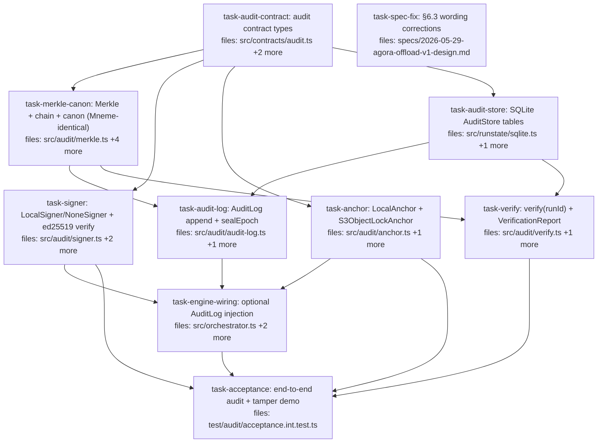

## Context

Implements the **`offload-audit`** wave per
`docs/superpowers/specs/2026-05-31-agora-offload-audit-design.md` (and §6.3/§6.5/§6.6
of the V1 design). Branched off `main` (post `offload-escape` #19).

The engine-side tamper-evident audit log: a per-run hash-chain → Merkle root →
signature → external anchor, plus `verify(runId)`. **Audit entries are the
orchestrator's own engine operations** (submit/fire/reconcile/retry/skip/
run-complete) — executor-agnostic (V1-D4), so the audit layer references no
AI/dispatch concepts. Entries accrue via an **optional** `AuditLog` injection
(exactly like the existing `packs?` option), so with no AuditLog the engine
behaves identically to today.

### Load-bearing constraint: Mneme byte-parity

agora and Mneme are the two halves of the platform; their audit **roots and
signatures MUST cross-verify**. The protocol below is transcribed from Mneme's
*shipped* code (`C:/Users/brett/source/repos/My_Projects/Mneme/src/audit/
{types,merkle,audit-log,signers}.ts`), verified this session:

- **Canon** = positional `JSON.stringify([...ordered fields])` (NOT JCS, no lib);
  each product pins its own field array, the *rules* match.
- **Chain:** `entryHash = sha256(canon(entry) + prevHash).digest('hex')` (canon
  string first, prev hex appended, **no domain tag**); genesis `prevHash = ""`.
- **Merkle:** leaf `SHA256(0x00 ‖ leafBytes)`, internal `SHA256(0x01 ‖ L ‖ R)`,
  empty → 32 zero bytes, **odd node carried up unhashed**; leaves = entry-hash
  hex decoded to 32 raw bytes.
- **Signer:** ed25519 (`node:crypto`), sign over `Buffer.from(root)`,
  `alg:'ed25519'`, public key SPKI-DER. `NoneSigner` → `{alg:'none', bytes:[]}`.
- **Contract** (`AuditAnchor`/`Signer`/…) byte-identical to Mneme `src/audit/types.ts`
  (no `listEpochs`; `fetch`'s `since?: string` carries a numeric epoch-ms — mirrored).

agora **extends** Mneme on three points (Mneme lacks them): the committed
**conformance vectors**, the real `S3ObjectLockAnchor.fetch()`, and the unified
`verify(runId)` routine. These become the shared reference Mneme adopts.

### Execution constraints (read before running)

- Another instance may share the main working tree — execute in this **isolated
  worktree** (`../agora-offload-audit`, branch `feat/offload-audit`) and run tasks
  **SEQUENTIALLY** (concurrent implementers race the single git index). The DAG
  edges are correctness ordering; the worker chains are genuinely independent but
  still run serially.
- Each task's gate MUST run **`typecheck`** (`pnpm --filter
  @quarry-systems/agora-orchestrator typecheck` — vitest's esbuild silently
  ignores type errors) AND the package test suite.
- No `src/index.ts` (package-root) exports this wave — audit symbols are internal
  to the orchestrator package + its tests; CLI exposure is `offload-surface`.
  Only `task-audit-contract` edits a barrel (`contracts/index.ts`).

## Tasks

## Task: audit contract types

```yaml
id: task-audit-contract
depends_on: []
files:
  - packages/agora-orchestrator/src/contracts/audit.ts
  - packages/agora-orchestrator/src/contracts/index.ts
  - packages/agora-orchestrator/test/audit/contract.test.ts
status: done
```

Define the §6.3 audit contract — `Signer`/`AuditAnchor`/`Signature`/
`AnchorReceipt`/`AnchoredRoot`/`Guarantee`/`GUARANTEE_RANK` **verbatim from Mneme
`src/audit/types.ts`** — plus agora's own `AuditEntry`, `VerificationReport`, and
the `AuditStore` persistence interface. Export the contract from the package
contracts barrel.

## Implementation

```typescript
// packages/agora-orchestrator/src/contracts/audit.ts
// Verbatim from Mneme src/audit/types.ts (cross-system byte-parity required):
export type Guarantee = 'detect' | 'external-immutable' | 'witnessed';
export const GUARANTEE_RANK: Record<Guarantee, number> = { detect: 0, 'external-immutable': 1, witnessed: 2 };
export interface Signature { alg: string; bytes: Uint8Array; keyRef?: string; }
export interface AnchorReceipt { anchorId: string; epochId: string; guarantee: Guarantee; at: number; locator?: string; }
export interface AnchoredRoot { epochId: string; root: Uint8Array; signature?: Signature; receipt: AnchorReceipt; }
export interface Signer { sign(rootHash: Uint8Array): Promise<Signature>; readonly keyRef?: string; }
export interface AuditAnchor {
  readonly id: string;
  readonly guarantee: Guarantee;
  anchor(epoch: { epochId: string; root: Uint8Array; signature?: Signature }): Promise<AnchorReceipt>;
  fetch(range: { epochId?: string; since?: string }): Promise<AnchoredRoot[]>; // since is numeric epoch-ms at runtime
}

// agora-pinned entry (epoch = run; chain is per-run):
export type AuditEntryKind =
  | 'run.submitted' | 'item.fired' | 'item.reconciled'
  | 'item.retried' | 'item.skipped' | 'run.cancelled' | 'run.completed';
export interface AuditEntry {
  runId: string; seq: number; kind: AuditEntryKind;
  itemId?: string; status?: string; actor?: string;
  manifestRef?: string; resultRef?: string; at: string; // ISO-8601
}
export interface VerificationReport {
  runId: string; intact: boolean; anchorId: string; guarantee: Guarantee;
  claim: 'tamper-evident' | 'tamper-detecting';
  failure?: 'chain' | 'anchor-missing' | 'root-mismatch' | 'signature';
}

// Persisted audit row (entry + chain links) and the store seam:
export interface AuditEntryRow extends AuditEntry { entryHash: string; prevHash: string; }
export interface AuditStore {
  appendAuditEntry(row: AuditEntryRow): void;
  getAuditEntries(runId: string): AuditEntryRow[];     // ordered by seq
  getAuditChainHead(runId: string): string;            // last entryHash, or '' if none
  putAuditRoot(root: AnchoredRoot): void;
  getAuditRoot(epochId: string): AnchoredRoot | undefined;
}
```

Add `export * from './audit.js';` to `contracts/index.ts`.

```typescript
// packages/agora-orchestrator/test/audit/contract.test.ts
import { describe, it, expect } from 'vitest';
import { GUARANTEE_RANK } from '../../src/contracts/index.js';
it('GUARANTEE_RANK licenses tamper-evident only at external-immutable+', () => {
  expect(GUARANTEE_RANK.detect).toBe(0);
  expect(GUARANTEE_RANK['external-immutable']).toBe(1);
  expect(GUARANTEE_RANK.witnessed).toBe(2);
  expect(GUARANTEE_RANK['external-immutable'] >= GUARANTEE_RANK.detect).toBe(true);
});
```

## Acceptance criteria

- `Guarantee`, `GUARANTEE_RANK`, `Signature`, `AnchorReceipt`, `AnchoredRoot`,
  `Signer`, `AuditAnchor` match Mneme `src/audit/types.ts` field-for-field (no
  `listEpochs`; `fetch` range `{epochId?, since?: string}`).
- `AuditEntry`, `AuditEntryKind`, `VerificationReport`, `AuditEntryRow`,
  `AuditStore` are defined and exported via `contracts/index.ts`.
- Package `typecheck` is clean; existing orchestrator tests untouched.

Test file: `packages/agora-orchestrator/test/audit/contract.test.ts`.

## Task: Merkle + chain + canon (Mneme-identical)

```yaml
id: task-merkle-canon
depends_on: [task-audit-contract]
files:
  - packages/agora-orchestrator/src/audit/merkle.ts
  - packages/agora-orchestrator/src/audit/canon.ts
  - packages/agora-orchestrator/test/audit/merkle.test.ts
  - packages/agora-orchestrator/test/conformance/audit-vectors/chain-basic.json
  - packages/agora-orchestrator/test/conformance/audit-vectors/merkle-odd.json
  - packages/agora-orchestrator/test/conformance/audit-vectors/merkle-empty.json
status: done
```

The pure crypto primitives, byte-identical to Mneme, plus the committed
conformance vectors that pin them. This is the load-bearing cross-system parity
code — match Mneme `src/audit/merkle.ts` + the `audit-log.ts` chain hash exactly.

## Implementation

```typescript
// packages/agora-orchestrator/src/audit/merkle.ts  (verbatim shape from Mneme)
import { createHash } from 'node:crypto';
const sha = (b: Uint8Array) => new Uint8Array(createHash('sha256').update(b).digest());
const pair = (a: Uint8Array, b: Uint8Array) => sha(Buffer.concat([Buffer.from([0x01]), a, b]));
/** empty -> 32 zero bytes; odd node promoted unhashed; leaf=0x00, internal=0x01. */
export function merkleRoot(leaves: Uint8Array[]): Uint8Array {
  if (leaves.length === 0) return new Uint8Array(32);
  let level = leaves.map((l) => sha(Buffer.concat([Buffer.from([0x00]), l])));
  while (level.length > 1) {
    const next: Uint8Array[] = [];
    for (let i = 0; i < level.length; i += 2)
      next.push(i + 1 < level.length ? pair(level[i]!, level[i + 1]!) : level[i]!);
    level = next;
  }
  return level[0]!;
}
/** entry-hash hex -> 32 raw bytes (the Merkle leaf input). */
export function leavesFromEntryHashes(hexes: string[]): Uint8Array[] {
  return hexes.map((h) => Uint8Array.from(Buffer.from(h, 'hex')));
}
/** chain hash: sha256(canon + prevHash) hex; no domain tag; genesis prev = ''. */
export function chainHash(canonStr: string, prevHash: string): string {
  return createHash('sha256').update(canonStr + prevHash).digest('hex');
}
```

```typescript
// packages/agora-orchestrator/src/audit/canon.ts
import type { AuditEntry } from '../contracts/index.js';
/** Positional JSON array — agora's pinned field order. NOT JCS. nulls for absent. */
export function canonEntry(e: AuditEntry): string {
  return JSON.stringify([
    e.kind, e.runId, e.itemId ?? null, e.status ?? null, e.actor ?? null,
    e.manifestRef ?? null, e.resultRef ?? null, e.at, e.seq,
  ]);
}
```

```typescript
// packages/agora-orchestrator/test/audit/merkle.test.ts
import { describe, it, expect } from 'vitest';
import { merkleRoot } from '../../src/audit/merkle.js';
import merkleEmpty from '../conformance/audit-vectors/merkle-empty.json';
it('empty tree is 32 zero bytes', () => {
  expect(Buffer.from(merkleRoot([])).toString('hex')).toBe('00'.repeat(32));
  expect(Buffer.from(merkleRoot([])).toString('hex')).toBe(merkleEmpty.root);
});
it('odd leaf count carries up the last node (not duplicated)', () => {
  // 3 leaves: root = pair(pair(L0,L1), leaf2-carried) — matches merkle-odd.json vector
  const leaves = [Uint8Array.from([1]), Uint8Array.from([2]), Uint8Array.from([3])];
  expect(Buffer.from(merkleRoot(leaves)).toString('hex')).toMatch(/^[0-9a-f]{64}$/);
});
```

`*.json` vectors: each carries `{ description, input, expected }`. `chain-basic.json`
encodes a 2-entry chain (genesis `''`, then `chainHash`); `merkle-odd.json` a
3-leaf root; `merkle-empty.json` the 32-zero root. These are the shared fixtures.

## Acceptance criteria

- `merkleRoot([])` → 32 zero bytes; leaf uses `0x00`, internal `0x01`; an odd node
  is carried up unhashed (a vector + test prove it differs from duplicate-last).
- `chainHash(canon, prev)` = `sha256(canon + prev)` hex; genesis prev `''`.
- `canonEntry` emits the pinned positional array `[kind, runId, itemId, status,
  actor, manifestRef, resultRef, at, seq]` with `null` for absent optionals.
- The three conformance vectors exist and the tests assert against them.

Test file: `packages/agora-orchestrator/test/audit/merkle.test.ts`.

## Task: LocalSigner/NoneSigner + ed25519 verify

```yaml
id: task-signer
depends_on: [task-audit-contract]
files:
  - packages/agora-orchestrator/src/audit/signer.ts
  - packages/agora-orchestrator/test/audit/signer.test.ts
  - packages/agora-orchestrator/test/conformance/audit-vectors/sign-ed25519.json
status: done
```

ed25519 signing + a matching verifier, byte-identical to Mneme `src/audit/
signers.ts`, plus the `sign-ed25519` conformance vector (fixed keypair → known
signature, and a verify true/false pair).

## Implementation

```typescript
// packages/agora-orchestrator/src/audit/signer.ts
import { generateKeyPairSync, sign as nodeSign, verify as nodeVerify, createPublicKey } from 'node:crypto';
import type { Signer, Signature } from '../contracts/index.js';

export const NoneSigner: Signer = { async sign() { return { alg: 'none', bytes: new Uint8Array(0) }; } };

/** ed25519 local signer; public key exported SPKI-DER (Mneme baseline). */
export function createLocalSigner(keyRef = 'local'): Signer & { publicKey: Buffer } {
  const { privateKey, publicKey } = generateKeyPairSync('ed25519');
  return {
    keyRef,
    publicKey: publicKey.export({ type: 'spki', format: 'der' }) as Buffer,
    async sign(root: Uint8Array): Promise<Signature> {
      return { alg: 'ed25519', bytes: new Uint8Array(nodeSign(null, Buffer.from(root), privateKey)), keyRef };
    },
  };
}

/** Verify an ed25519 signature over the root against an SPKI-DER public key. */
export function verifyEd25519(root: Uint8Array, sig: Signature, spkiDer: Uint8Array): boolean {
  if (sig.alg !== 'ed25519') return false;
  const key = createPublicKey({ key: Buffer.from(spkiDer), format: 'der', type: 'spki' });
  return nodeVerify(null, Buffer.from(root), key, Buffer.from(sig.bytes));
}
```

```typescript
// packages/agora-orchestrator/test/audit/signer.test.ts
import { describe, it, expect } from 'vitest';
import { createLocalSigner, verifyEd25519, NoneSigner } from '../../src/audit/signer.js';
it('LocalSigner round-trips: a signed root verifies, a tampered root does not', async () => {
  const s = createLocalSigner();
  const root = new Uint8Array(32).fill(7);
  const sig = await s.sign(root);
  expect(sig.alg).toBe('ed25519');
  expect(verifyEd25519(root, sig, s.publicKey)).toBe(true);
  const bad = new Uint8Array(32).fill(8);
  expect(verifyEd25519(bad, sig, s.publicKey)).toBe(false);
});
it('NoneSigner emits an empty none-signature', async () => {
  expect(await NoneSigner.sign(new Uint8Array(32))).toEqual({ alg: 'none', bytes: new Uint8Array(0) });
});
```

`sign-ed25519.json`: a fixed SPKI-DER public key + a 32-byte root + the expected
signature bytes (hex), plus a verify-false case. Pins ed25519/SPKI cross-parity.

## Acceptance criteria

- `createLocalSigner()` produces `alg:'ed25519'` signatures over `Buffer.from(root)`
  and exposes an SPKI-DER `publicKey`.
- `verifyEd25519` returns true for a valid (root,sig,pubkey) and false for a
  tampered root, wrong key, or non-ed25519 `alg`.
- `NoneSigner` → `{alg:'none', bytes: 0-length}`.
- The `sign-ed25519` conformance vector exists and verifies.

Test file: `packages/agora-orchestrator/test/audit/signer.test.ts`.

## Task: LocalAnchor + S3ObjectLockAnchor

```yaml
id: task-anchor
depends_on: [task-audit-contract]
files:
  - packages/agora-orchestrator/src/audit/anchor.ts
  - packages/agora-orchestrator/test/audit/anchor.test.ts
status: done
```

The two `AuditAnchor` adapters: `LocalAnchor` (`detect`, persists the signed root
in the engine's own `AuditStore`) and `S3ObjectLockAnchor` (`external-immutable`,
`PutObject` with Object-Lock COMPLIANCE retention + a real `GetObject` `fetch` —
the implementation Mneme lacks).

## Implementation

```typescript
// packages/agora-orchestrator/src/audit/anchor.ts
import type { AuditAnchor, AnchorReceipt, AnchoredRoot, AuditStore } from '../contracts/index.js';

/** detect tier: root + head in the same store. Not evidence vs a DB-controlling attacker. */
export class LocalAnchor implements AuditAnchor {
  readonly id = 'local';
  readonly guarantee = 'detect' as const;
  constructor(private readonly store: AuditStore, private readonly now: () => number = () => Date.now()) {}
  async anchor(epoch: { epochId: string; root: Uint8Array; signature?: AnchoredRoot['signature'] }): Promise<AnchorReceipt> {
    const receipt: AnchorReceipt = { anchorId: this.id, epochId: epoch.epochId, guarantee: this.guarantee, at: this.now() };
    this.store.putAuditRoot({ epochId: epoch.epochId, root: epoch.root, signature: epoch.signature, receipt });
    return receipt;
  }
  async fetch(range: { epochId?: string }): Promise<AnchoredRoot[]> {
    const r = range.epochId ? this.store.getAuditRoot(range.epochId) : undefined;
    return r ? [r] : [];
  }
}

// S3ObjectLockAnchor (external-immutable): inject a minimal S3 client seam
//   { putObject(key, body, {objectLockRetainUntil, mode:'COMPLIANCE'}), getObject(key) }.
// anchor(): serialize {root, signature, receipt} -> PutObject under
//   `audit/roots/<epochId>.json` with retention; receipt.locator = `s3://<bucket>/<key>`.
// fetch(): GetObject the key(s) -> deserialize AnchoredRoot[]. (Tested vs a faked client,
//   mirroring agora-storage-s3 / AwsSecretStore test style.)
```

```typescript
// packages/agora-orchestrator/test/audit/anchor.test.ts
import { describe, it, expect } from 'vitest';
import { LocalAnchor } from '../../src/audit/anchor.js';
function memStore() { const m = new Map(); return {
  putAuditRoot: (r: any) => m.set(r.epochId, r), getAuditRoot: (id: string) => m.get(id),
  appendAuditEntry() {}, getAuditEntries: () => [], getAuditChainHead: () => '' }; }
it('LocalAnchor anchors then fetches the same root (detect tier)', async () => {
  const a = new LocalAnchor(memStore() as any, () => 1000);
  const root = new Uint8Array(32).fill(9);
  const receipt = await a.anchor({ epochId: 'run-1', root });
  expect(receipt).toMatchObject({ anchorId: 'local', epochId: 'run-1', guarantee: 'detect', at: 1000 });
  const got = await a.fetch({ epochId: 'run-1' });
  expect(Buffer.from(got[0]!.root).toString('hex')).toBe('09'.repeat(32));
});
```

## Acceptance criteria

- `LocalAnchor` (`id:'local'`, `guarantee:'detect'`) anchors a signed root into the
  injected `AuditStore` and `fetch({epochId})` returns it; unknown epoch → `[]`.
- `S3ObjectLockAnchor` (`id:`s3:${bucket}``, `guarantee:'external-immutable'`)
  `PutObject`s the root with Object-Lock COMPLIANCE retention, sets
  `receipt.locator = s3://bucket/key`, and `fetch` `GetObject`s it back — verified
  against a faked S3 client (the real fetch Mneme stubs).
- Neither anchor leaks secret material; both round-trip `AnchoredRoot` faithfully.

Test file: `packages/agora-orchestrator/test/audit/anchor.test.ts`.

## Task: SQLite AuditStore tables

```yaml
id: task-audit-store
depends_on: [task-audit-contract]
files:
  - packages/agora-orchestrator/src/runstate/sqlite.ts
  - packages/agora-orchestrator/test/audit/audit-store.test.ts
status: done
```

Make `SqliteRunStateStore` also implement `AuditStore` (it already owns the DB +
guarded migrations; sole writer per D3). Additive `audit_entries` + `audit_roots`
tables and their CRUD. No change to existing `RunStateStore` behavior.

## Implementation

```typescript
// packages/agora-orchestrator/src/runstate/sqlite.ts — additive
// SCHEMA additions (CREATE TABLE IF NOT EXISTS), idempotent like the existing schema:
//   audit_entries(run_id, seq, kind, item_id, status, actor, manifest_ref, result_ref,
//                 at, entry_hash, prev_hash, PRIMARY KEY(run_id, seq))
//   audit_roots(epoch_id PRIMARY KEY, root BLOB, sig_alg, sig_bytes BLOB, sig_keyref,
//               anchor_id, guarantee, receipt_at INTEGER, locator, anchored_at)
// class SqliteRunStateStore implements RunStateStore, AuditStore {
appendAuditEntry(r: AuditEntryRow): void {
  this.db.prepare(`INSERT INTO audit_entries
    (run_id,seq,kind,item_id,status,actor,manifest_ref,result_ref,at,entry_hash,prev_hash)
    VALUES (?,?,?,?,?,?,?,?,?,?,?)`).run(r.runId, r.seq, r.kind, r.itemId ?? null,
    r.status ?? null, r.actor ?? null, r.manifestRef ?? null, r.resultRef ?? null,
    r.at, r.entryHash, r.prevHash);
}
getAuditEntries(runId: string): AuditEntryRow[] { /* SELECT ... WHERE run_id=? ORDER BY seq; map rows */ }
getAuditChainHead(runId: string): string { /* SELECT entry_hash ... ORDER BY seq DESC LIMIT 1; '' if none */ }
putAuditRoot(root: AnchoredRoot): void { /* upsert audit_roots; store root + signature bytes as BLOB */ }
getAuditRoot(epochId: string): AnchoredRoot | undefined { /* SELECT; rebuild AnchoredRoot incl. receipt */ }
```

```typescript
// packages/agora-orchestrator/test/audit/audit-store.test.ts
import { describe, it, expect } from 'vitest';
import { SqliteRunStateStore } from '../../src/runstate/sqlite.js';
it('appends + reads audit entries in seq order and tracks the chain head', () => {
  const s = new SqliteRunStateStore();
  s.appendAuditEntry({ runId: 'r', seq: 0, kind: 'run.submitted', at: 't0', entryHash: 'aa', prevHash: '' });
  s.appendAuditEntry({ runId: 'r', seq: 1, kind: 'item.fired', itemId: 'a', at: 't1', entryHash: 'bb', prevHash: 'aa' });
  expect(s.getAuditEntries('r').map((e) => e.seq)).toEqual([0, 1]);
  expect(s.getAuditChainHead('r')).toBe('bb');
  expect(s.getAuditChainHead('missing')).toBe('');
});
it('round-trips an anchored root (root bytes + signature + receipt)', () => {
  const s = new SqliteRunStateStore();
  const root = new Uint8Array(32).fill(5);
  s.putAuditRoot({ epochId: 'r', root, signature: { alg: 'ed25519', bytes: new Uint8Array([1, 2]) },
    receipt: { anchorId: 'local', epochId: 'r', guarantee: 'detect', at: 1 } });
  const got = s.getAuditRoot('r')!;
  expect(Buffer.from(got.root)).toEqual(Buffer.from(root));
  expect(got.signature!.alg).toBe('ed25519');
});
```

## Acceptance criteria

- Fresh + pre-existing DBs gain `audit_entries` + `audit_roots` idempotently
  (existing run-state migration tests still pass).
- `appendAuditEntry`/`getAuditEntries` round-trip in `seq` order; `getAuditChainHead`
  returns the last `entry_hash` or `''`.
- `putAuditRoot`/`getAuditRoot` faithfully round-trip root bytes + optional
  signature + receipt.
- `SqliteRunStateStore` satisfies both `RunStateStore` and `AuditStore`
  (typecheck); all pre-existing sqlite/orchestrator tests pass.

Test file: `packages/agora-orchestrator/test/audit/audit-store.test.ts`.

## Task: AuditLog append + sealEpoch

```yaml
id: task-audit-log
depends_on: [task-audit-contract, task-merkle-canon, task-audit-store]
files:
  - packages/agora-orchestrator/src/audit/audit-log.ts
  - packages/agora-orchestrator/test/audit/audit-log.test.ts
status: done
```

The `AuditLog`: `append(entry)` chains + persists per-run; `sealEpoch(runId)`
Merkle-roots the run's entry hashes, signs, anchors, and persists the
`AnchoredRoot`. Signer + Anchor are injected (D8). Executor-agnostic.

## Implementation

```typescript
// packages/agora-orchestrator/src/audit/audit-log.ts
import type { AuditStore, AuditEntry, Signer, AuditAnchor, AnchorReceipt } from '../contracts/index.js';
import { canonEntry } from './canon.js';
import { chainHash, merkleRoot, leavesFromEntryHashes } from './merkle.js';

export class AuditLog {
  constructor(private readonly deps: { store: AuditStore; signer: Signer; anchor: AuditAnchor }) {}

  /** Assign per-run seq, chain off the current head, persist. */
  append(entry: Omit<AuditEntry, 'seq'>): void {
    const existing = this.deps.store.getAuditEntries(entry.runId);
    const seq = existing.length;
    const prevHash = this.deps.store.getAuditChainHead(entry.runId); // '' at genesis
    const full: AuditEntry = { ...entry, seq };
    const entryHash = chainHash(canonEntry(full), prevHash);
    this.deps.store.appendAuditEntry({ ...full, entryHash, prevHash });
  }

  /** epoch = run: Merkle over the run's entry hashes -> sign -> anchor -> persist. */
  async sealEpoch(runId: string): Promise<AnchorReceipt> {
    const hashes = this.deps.store.getAuditEntries(runId).map((e) => e.entryHash);
    const root = merkleRoot(leavesFromEntryHashes(hashes));
    const signature = await this.deps.signer.sign(root);
    return this.deps.anchor.anchor({ epochId: runId, root, signature });
  }
}
```

```typescript
// packages/agora-orchestrator/test/audit/audit-log.test.ts
// AuditLog depends only on the Signer/AuditAnchor INTERFACES (task-audit-contract);
// unit-isolate it with inline fakes (real impls are exercised in engine-wiring/acceptance).
import { describe, it, expect } from 'vitest';
import { SqliteRunStateStore } from '../../src/runstate/sqlite.js';
import { AuditLog } from '../../src/audit/audit-log.js';
const fakeSigner = { async sign() { return { alg: 'none', bytes: new Uint8Array(0) }; } };
function fakeAnchor() { const roots = new Map<string, any>(); return {
  id: 'fake', guarantee: 'detect' as const,
  async anchor(e: any) { const r = { anchorId: 'fake', epochId: e.epochId, guarantee: 'detect', at: 0 };
    roots.set(e.epochId, { ...e, receipt: r }); return r; },
  async fetch(q: any) { const r = roots.get(q.epochId); return r ? [r] : []; } }; }
it('append chains entries (genesis prev empty) and sealEpoch anchors a root', async () => {
  const store = new SqliteRunStateStore();
  const anchor = fakeAnchor();
  const log = new AuditLog({ store, signer: fakeSigner, anchor });
  log.append({ runId: 'r', kind: 'run.submitted', actor: 'human:brett', at: 't0' });
  log.append({ runId: 'r', kind: 'item.fired', itemId: 'a', manifestRef: 'm', at: 't1' });
  const entries = store.getAuditEntries('r');
  expect(entries[0]!.prevHash).toBe('');
  expect(entries[1]!.prevHash).toBe(entries[0]!.entryHash);
  const receipt = await log.sealEpoch('r');
  expect(receipt.epochId).toBe('r');
  expect((await anchor.fetch({ epochId: 'r' })).length).toBe(1);
});
```

## Acceptance criteria

- `append` assigns a per-run monotonic `seq`, sets `prevHash` to the run's chain
  head (`''` at seq 0), computes `entryHash = chainHash(canonEntry, prevHash)`, and
  persists the row.
- `sealEpoch(runId)` Merkle-roots the run's `entryHash`es (via
  `leavesFromEntryHashes` + `merkleRoot`), signs the root with the injected
  `Signer`, anchors it via the injected `AuditAnchor`, and the root is retrievable.
- No secret values are ever written into an entry (entries carry refs only).

Test file: `packages/agora-orchestrator/test/audit/audit-log.test.ts`.

## Task: verify(runId) + VerificationReport

```yaml
id: task-verify
depends_on: [task-audit-contract, task-merkle-canon, task-audit-store]
files:
  - packages/agora-orchestrator/src/audit/verify.ts
  - packages/agora-orchestrator/test/audit/verify.test.ts
status: done
```

`verify(runId)`: recompute the chain → recompute the Merkle root → `anchor.fetch()`
the anchored root → compare → verify the signature → emit a `VerificationReport`.
The proven `claim` follows what verification can prove, never the configured tier.

## Implementation

```typescript
// packages/agora-orchestrator/src/audit/verify.ts
import type { AuditStore, AuditAnchor, VerificationReport, Signature } from '../contracts/index.js';
import { GUARANTEE_RANK } from '../contracts/index.js';
import { canonEntry } from './canon.js';
import { chainHash, merkleRoot, leavesFromEntryHashes } from './merkle.js';

export async function verify(runId: string, deps: {
  store: AuditStore; anchor: AuditAnchor;
  verifySignature?: (root: Uint8Array, sig: Signature) => boolean;
}): Promise<VerificationReport> {
  const g = deps.anchor.guarantee;
  const base = { runId, anchorId: deps.anchor.id, guarantee: g };
  const fail = (failure: VerificationReport['failure']): VerificationReport =>
    ({ ...base, intact: false, claim: 'tamper-detecting', failure });

  const entries = deps.store.getAuditEntries(runId);
  // 1. recompute the chain
  let prev = '';
  for (const e of entries) {
    const h = chainHash(canonEntry(e), prev);
    if (h !== e.entryHash || e.prevHash !== prev) return fail('chain');
    prev = e.entryHash;
  }
  // 2. recompute the Merkle root
  const recomputed = merkleRoot(leavesFromEntryHashes(entries.map((e) => e.entryHash)));
  // 3. fetch the anchored root (MUST consult the anchor, not a local copy)
  const anchored = (await deps.anchor.fetch({ epochId: runId }))[0];
  if (!anchored) return fail('anchor-missing');
  // 4. compare
  if (Buffer.compare(Buffer.from(recomputed), Buffer.from(anchored.root)) !== 0) return fail('root-mismatch');
  // 5. signature
  if (anchored.signature && deps.verifySignature && !deps.verifySignature(anchored.root, anchored.signature))
    return fail('signature');
  // 6. proven tier
  const claim = GUARANTEE_RANK[g] >= GUARANTEE_RANK['external-immutable'] ? 'tamper-evident' : 'tamper-detecting';
  return { ...base, intact: true, claim };
}
```

```typescript
// packages/agora-orchestrator/test/audit/verify.test.ts
// Unit-isolate verify: build a valid chain manually via the store + T2 primitives,
// and feed an inline fake AuditAnchor (real anchors/signers are exercised in acceptance).
import { describe, it, expect } from 'vitest';
import { SqliteRunStateStore } from '../../src/runstate/sqlite.js';
import { canonEntry } from '../../src/audit/canon.js';
import { chainHash, merkleRoot, leavesFromEntryHashes } from '../../src/audit/merkle.js';
import { verify } from '../../src/audit/verify.js';

function seed(store: SqliteRunStateStore, runId: string) {
  const mk = (e: any, prev: string) => { const seq = e.seq; const eh = chainHash(canonEntry({ ...e, runId }), prev);
    store.appendAuditEntry({ ...e, runId, entryHash: eh, prevHash: prev }); return eh; };
  const h0 = mk({ seq: 0, kind: 'run.submitted', at: 't0' }, '');
  const h1 = mk({ seq: 1, kind: 'run.completed', at: 't1' }, h0);
  return merkleRoot(leavesFromEntryHashes([h0, h1]));
}
const anchorOf = (root: Uint8Array, guarantee = 'detect' as const) => ({
  id: 'fake', guarantee,
  async anchor() { return { anchorId: 'fake', epochId: 'r', guarantee, at: 0 }; },
  async fetch() { return [{ epochId: 'r', root, receipt: { anchorId: 'fake', epochId: 'r', guarantee, at: 0 } }]; },
});
it('a clean run verifies intact; detect anchor -> tamper-detecting', async () => {
  const store = new SqliteRunStateStore();
  const root = seed(store, 'r');
  const report = await verify('r', { store, anchor: anchorOf(root) });
  expect(report).toMatchObject({ intact: true, guarantee: 'detect', claim: 'tamper-detecting' });
});
it('external-immutable anchor on a clean run -> tamper-evident', async () => {
  const store = new SqliteRunStateStore();
  const root = seed(store, 'r');
  expect((await verify('r', { store, anchor: anchorOf(root, 'external-immutable') })).claim).toBe('tamper-evident');
});
it('mutating a persisted entry fails verification', async () => {
  const store = new SqliteRunStateStore();
  const root = seed(store, 'r');
  // mutate row 1's status directly via the store's db, then re-verify
  // (store exposes the db, or add a test-only setter) -> expect intact:false, claim 'tamper-detecting'
});
it('a missing anchored root reports anchor-missing', async () => {
  const store = new SqliteRunStateStore(); seed(store, 'r');
  const empty = { id: 'x', guarantee: 'detect' as const, async anchor() { return {} as any; }, async fetch() { return []; } };
  expect((await verify('r', { store, anchor: empty })).failure).toBe('anchor-missing');
});
```

## Acceptance criteria

- A clean sealed run → `intact:true`; `claim:'tamper-detecting'` under a `detect`
  anchor, `'tamper-evident'` under an `external-immutable` anchor.
- A mutated persisted entry → `intact:false` with `failure:'chain'` or
  `'root-mismatch'`, and `claim` drops to `'tamper-detecting'`.
- A missing/unreachable anchored root → `failure:'anchor-missing'`.
- A bad signature (when a `verifySignature` is supplied) → `failure:'signature'`.
- `claim` is `tamper-evident` ONLY when `intact` AND guarantee ≥ external-immutable.

Test file: `packages/agora-orchestrator/test/audit/verify.test.ts`.

## Task: optional AuditLog injection

```yaml
id: task-engine-wiring
depends_on: [task-audit-log, task-signer, task-anchor]
files:
  - packages/agora-orchestrator/src/orchestrator.ts
  - packages/agora-orchestrator/src/engine/tick.ts
  - packages/agora-orchestrator/test/audit/engine-wiring.test.ts
status: done
```

Wire the `AuditLog` into the engine as an **optional** construction-time
injection (mirroring `packs?`): append entries on submit / fire / reconcile /
retry / skip, and seal the epoch on run-completion. With no `auditLog` the engine
is byte-for-byte today's behavior.

## Implementation

```typescript
// orchestrator.ts: AgoraOrchestratorOptions gains `auditLog?: AuditLog`; store it.
//   submitRun(run, actor, submittedAt) -> auditLog?.append({kind:'run.submitted', runId: run.id, actor, at: now()})
//   In tick(), pass auditLog THROUGH THE opts OBJECT (NOT a new positional param —
//   a positional insert would shift `opts` and break every existing tick caller):
//     return tick(this.store, wrapped, queue, this.packs, { maxAttempts: this.maxAttempts, auditLog: this.auditLog });
//   After awaiting tick(): for each runId whose items are now ALL terminal and that
//   is not yet sealed (guard: getAuditRoot(runId) === undefined), append
//   {kind:'run.completed', runId, at} then `await auditLog.sealEpoch(runId)`.

// engine/tick.ts: extend the opts param with `auditLog?: AuditLog` (additive — do NOT
//   change the positional arity). Append on each transition, guarded by `opts.auditLog?.`.
//   itemId MUST be the LOGICAL (de-namespaced) id — tick sees `runId\x1f<id>`. Pass a
//   `denamespace?: (id: string) => string` THROUGH opts (orchestrator owns deNs); do NOT
//   import deNs from orchestrator.ts into tick.ts — that is a circular import
//   (orchestrator.ts already imports tick). `const deNs = opts.denamespace ?? ((x) => x);`
//   fire success:     auditLog?.append({kind:'item.fired', runId: it.runId, itemId: deNs(it.id), manifestRef, at})
//   reconcile done:   auditLog?.append({kind:'item.reconciled', runId: it.runId, itemId: deNs(it.id), status:'done', resultRef, at})
//   reconcile failed: auditLog?.append({kind:'item.reconciled', runId: it.runId, itemId: deNs(it.id), status:'failed', at})
//   retry:            auditLog?.append({kind:'item.retried', runId: it.runId, itemId: deNs(it.id), at})
//   skip cascade:     auditLog?.append({kind:'item.skipped', runId: it.runId, itemId: deNs(it.id), at})
// All guarded so the absent case is a no-op (existing tick callers/tests unaffected).
// tick passes only opaque strings — it never inspects entry semantics (V1-D4).
```

```typescript
// packages/agora-orchestrator/test/audit/engine-wiring.test.ts
import { describe, it, expect } from 'vitest';
// Build an AgoraOrchestrator with a real SqliteRunStateStore + AuditLog (NoneSigner +
// LocalAnchor) + a fake executor; submit a 1-item run; drive ticks to done; then:
it('accrues audit entries through a run and seals on completion', async () => {
  // const entries = store.getAuditEntries(runId).map(e => e.kind);
  // expect(entries).toEqual(['run.submitted','item.fired','item.reconciled','run.completed']);
  // expect(store.getAuditRoot(runId)).toBeTruthy();
});
it('with no auditLog injected, behavior is unchanged (no audit tables written)', async () => {
  // submit+drive a run with auditLog omitted; expect store.getAuditEntries(runId) === []
});
```

## Acceptance criteria

- `AgoraOrchestratorOptions.auditLog?` is optional; absent → no audit calls and
  all pre-existing orchestrator/tick/serve/pressure tests pass unchanged.
- When present: `run.submitted` on submit; `item.fired` (with `manifestRef`) on
  fire; `item.reconciled` (status + `resultRef`) on terminal reconcile;
  `item.retried`/`item.skipped` on those transitions; `run.completed` + a single
  `sealEpoch` when the run goes fully terminal (no double-seal).
- `tick` passes only opaque strings to the audit log (no dispatch/AI concepts).

Test file: `packages/agora-orchestrator/test/audit/engine-wiring.test.ts`.

## Task: §6.3 wording corrections

```yaml
id: task-spec-fix
depends_on: []
files:
  - docs/superpowers/specs/2026-05-29-agora-offload-v1-design.md
status: done
is_wiring_task: true
```

Correct the two §6.3 transcription errors so the agora spec matches Mneme's
shipped protocol (the rest of §6.3 is already correct).

## Acceptance criteria

- §6.3 source-path citation changed from `src/contracts/audit.ts` to
  `src/audit/types.ts`.
- §6.3 odd-node rule changed from "an odd level duplicates its last node" to "an
  odd level carries up its last node unhashed."
- No other §6.3 content altered (genesis `''`, chain hash, Merkle domain tags,
  empty→32-zero, ed25519/SPKI, "ordered JSON-stringified field array" remain).

Test file: n/a (documentation; verified by reading the diff).

## Task: end-to-end audit + tamper demo

```yaml
id: task-acceptance
depends_on: [task-signer, task-anchor, task-verify, task-engine-wiring]
files:
  - packages/agora-orchestrator/test/audit/acceptance.int.test.ts
status: done
```

The §6.3/§10 acceptance gates, end to end: a real `AgoraOrchestrator` + `AuditLog`
(`LocalSigner` + an anchor) drives a run to completion; `verify` proves it intact
and names the tier; mutating a persisted entry makes `verify` fail; and the
`external-immutable` path catches a DB-side tamper against the anchored root.

## Implementation

```typescript
// Harness shape (reused across the cases): a real orchestrator wired with AuditLog,
// a fake compute/executor that completes exit 0, and the verify helper bound to the
// signer's public key. Mirrors the engine-wiring test setup.
function buildAudited(anchor) {
  const store = new SqliteRunStateStore();
  const signer = createLocalSigner();
  const auditLog = new AuditLog({ store, signer, anchor });
  const orch = new AgoraOrchestrator({ store, executors: { x: fakeDoneExecutor() },
    triggers: { manual: new ManualTrigger() }, queues: { default: { concurrency: 1 } }, auditLog });
  const check = (runId) => verify(runId, { store, anchor,
    verifySignature: (root, sig) => verifyEd25519(root, sig, signer.publicKey) });
  return { store, orch, check };
}
```

```typescript
// packages/agora-orchestrator/test/audit/acceptance.int.test.ts
import { describe, it, expect } from 'vitest';
// Wire AgoraOrchestrator(store, executors:{x:fake}, triggers, queues, auditLog:
//   new AuditLog({store, signer: createLocalSigner(), anchor: new LocalAnchor(store)})).
it('clean run verifies intact and reports tamper-detecting under LocalAnchor', async () => {
  // submit+drive a run to done; const r = await verify(runId, {store, anchor,
  //   verifySignature: (root,sig) => verifyEd25519(root, sig, signer.publicKey)});
  // expect(r.intact).toBe(true); expect(r.claim).toBe('tamper-detecting');
});
it('mutating a persisted audit entry makes verify fail', async () => {
  // after sealing, UPDATE audit_entries SET status=... via the store's db; re-verify
  // expect(r.intact).toBe(false);
});
it('external-immutable: a DB tamper is caught vs the anchored root', async () => {
  // seal under a faked S3ObjectLockAnchor (root stored in the immutable fake); then
  // mutate the DB entries (not the anchored root); verify -> root-mismatch, intact:false;
  // and on a clean run, claim === 'tamper-evident'.
});
it('no secret value appears in the serialized audit export', async () => {
  // stage a known secret on the dispatch; assert JSON.stringify(getAuditEntries+root)
  //   does NOT contain the secret value (refs only).
});
```

## Acceptance criteria

- A clean run under `LocalSigner` + `LocalAnchor` → `verify` `intact:true`,
  `claim:'tamper-detecting'`; the ed25519 signature verifies via `verifyEd25519`.
- Mutating any persisted `audit_entries` row makes `verify` return `intact:false`.
- Under a (faked) `S3ObjectLockAnchor`: a clean run reports `claim:'tamper-evident'`;
  a DB-side entry tamper (anchored root untouched) → `failure:'root-mismatch'`,
  `intact:false`.
- A serialized audit export (entries + root) contains NO known secret value.

Test file: `packages/agora-orchestrator/test/audit/acceptance.int.test.ts`.
