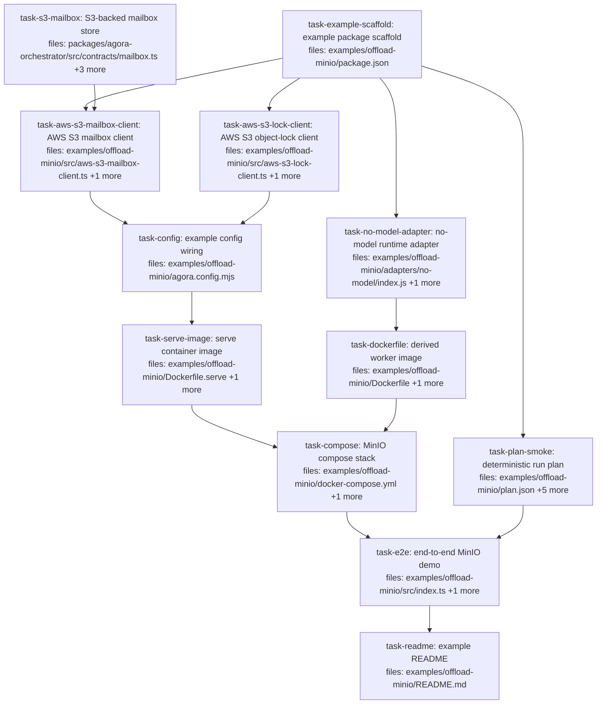

## Context

Implements the **Tier-1 MinIO proof** specified in
[`docs/superpowers/specs/2026-06-02-agora-offload-tier1-minio-proof-design.md`](../specs/2026-06-02-agora-offload-tier1-minio-proof-design.md).

Goal: prove the offload orchestrator runs as a remote-style service (submit over
an S3 inbox, no inbound networking, multi-executor routing, patch escape,
`external-immutable` audit) against free substitutes — MinIO + local Docker — and
in doing so build the two genuinely-missing production pieces (`S3Mailbox` + a
concrete `AwsS3LockClient`) so Tier-2 Fargate is a config swap.

**Two subsystems, cleanly separated:**
- `packages/agora-orchestrator` — one product-code task adds the S3 mailbox
  (`task-s3-mailbox`). `S3LockClient` already ships (index.ts:26), so no
  orchestrator change is needed for the anchor.
- `examples/offload-minio` — the new self-contained proof: concrete AWS clients,
  the no-model adapter, the compose stack (MinIO + serve container), config,
  run plan, the e2e/tamper test, CI smoke, and docs.

**Grounding facts verified against the codebase:**
- `MailboxStore` is a 4-method seam (`put/get/list/delete`); only `LocalDirMailbox`
  ships today. `S3Mailbox` is the gap (spec §1).
- `S3ObjectLockAnchor` already exists and takes an injected `S3LockClient`
  (`putObject` with `retainUntil`+`mode:'COMPLIANCE'`, `getObject`); both the class
  and the `S3LockClient` type are exported (index.ts:25-26).
- `S3StorageProvider` accepts an injected `client?: S3Client` for endpoint override
  ("LocalStack, MinIO, etc.").
- The worker resolves its adapter from `<adaptersRoot>/<name>/index.js` selected by
  `AGORA_RUNTIME_ADAPTER` (default `claude-code`); `WorkItem.inputs.env` flows
  straight to the dispatch, so per-item adapter selection is just an env var.
- `LocalDockerProvider` sets no `NetworkMode` (workers land on the default bridge →
  MinIO endpoint duality, spec §2.1) and exposes `extraBinds`.

**Execution note:** `task-config` and downstream import the new `S3Mailbox` symbol;
the dependency edges ensure `task-s3-mailbox`'s source lands first, but the
implementer for any orchestrator-consuming example task must run `pnpm -r build`
(or at least build `agora-orchestrator`) so the workspace `dist` carries the new
export before typecheck.

**Load-bearing risk to verify FIRST (audit finding A):** the per-item adapter
selection in spec §3 assumes `WorkItem.inputs.env` reaches the worker as raw
`KEY=VALUE` env that survives to the process (so `AGORA_RUNTIME_ADAPTER=no-model`
selects the adapter). This is **not yet verified** — `inputs.env` may be interpreted
as env-bundle *references*, and an env firewall may strip unrecognized vars.
Before/within `task-config`, confirm the mechanism by reading `agora-client`'s
dispatch env handling + `agora-worker`'s `env-parser`. Candidate fallbacks if raw
env doesn't pass through: (a) register a named env bundle that sets
`AGORA_RUNTIME_ADAPTER`; (b) bind the adapter to the subagent definition if the
subagent schema carries a `runtimeAdapter` field; (c) a second baked worker image
whose default `AGORA_RUNTIME_ADAPTER` is `no-model`, selected per-item via the
executor's `workerImage`. Per-item **data** (which file to edit) already avoids this
risk by going through `workerInput` → `spec.input` (the structured channel
`DispatchExecutor` maps), not env.

## Tasks

## Task: S3-backed mailbox store

```yaml
id: task-s3-mailbox
depends_on: []
files:
  - packages/agora-orchestrator/src/contracts/mailbox.ts
  - packages/agora-orchestrator/src/mailbox/s3.ts
  - packages/agora-orchestrator/src/index.ts
  - packages/agora-orchestrator/test/mailbox-s3.test.ts
status: pending
```

Add the `MailboxS3Client` injected seam to the existing `contracts/mailbox.ts`, and
implement `S3Mailbox` (a `MailboxStore`) over it — mirroring how `S3ObjectLockAnchor`
injects `S3LockClient` so the orchestrator gains no AWS-SDK dependency (spec §1, §1.1).
Export `S3Mailbox` from the package barrel (`MailboxS3Client` is re-exported
automatically via the existing `export * from './contracts/index.js'`).

## Implementation

```typescript
// packages/agora-orchestrator/src/contracts/mailbox.ts  (append)
/** Minimal injected S3 seam for S3Mailbox — keeps agora-orchestrator AWS-SDK-free.
 *  Keys are '/'-delimited logical paths under a bucket+prefix the impl owns. */
export interface MailboxS3Client {
  put(key: string, bytes: Uint8Array): Promise<void>;
  get(key: string): Promise<Uint8Array | null>;
  list(prefix: string): Promise<string[]>;   // returns full logical keys
  delete(key: string): Promise<void>;          // idempotent
}
```

```typescript
// packages/agora-orchestrator/src/mailbox/s3.ts
import type { MailboxStore, MailboxS3Client } from '../contracts/index.js';

/** MailboxStore backed by an injected S3 seam. Logic only — the concrete
 *  AWS-SDK client is supplied by the caller (example/Tier-2 storage pkg). */
export class S3Mailbox implements MailboxStore {
  constructor(private readonly s3: MailboxS3Client) {}
  put(key: string, bytes: Uint8Array): Promise<void> { return this.s3.put(key, bytes); }
  get(key: string): Promise<Uint8Array | null> { return this.s3.get(key); }
  delete(key: string): Promise<void> { return this.s3.delete(key); }
  async list(prefix: string): Promise<string[]> {
    // segment-boundary-safe prefix match, matching LocalDirMailbox semantics
    const dirPrefix = prefix.endsWith('/') ? prefix : prefix + '/';
    const keys = await this.s3.list(dirPrefix);
    return keys.filter((k) => k === prefix || k.startsWith(dirPrefix));
  }
}
```

```typescript
// packages/agora-orchestrator/test/mailbox-s3.test.ts
import { describe, it, expect } from 'vitest';
import { S3Mailbox } from '../src/mailbox/s3.js';
import type { MailboxS3Client } from '../src/contracts/index.js';

const fake = (): MailboxS3Client => {
  const m = new Map<string, Uint8Array>();
  return {
    put: async (k, b) => void m.set(k, b),
    get: async (k) => m.get(k) ?? null,
    list: async (p) => [...m.keys()].filter((k) => k.startsWith(p)),
    delete: async (k) => void m.delete(k),
  };
};

it('round-trips and prefix-lists at segment boundary', async () => {
  const mb = new S3Mailbox(fake());
  await mb.put('inbox/r1.json', new Uint8Array([1]));
  expect(await mb.get('inbox/r1.json')).toEqual(new Uint8Array([1]));
  expect(await mb.list('inbox')).toEqual(['inbox/r1.json']);
  expect(await mb.list('in')).toEqual([]); // 'in' must NOT match 'inbox/...'
});
```

## Acceptance criteria

- `MailboxS3Client` interface is exported from `@quarry-systems/agora-orchestrator`.
- `S3Mailbox` implements `MailboxStore` and is exported from the barrel.
- `list('inbox')` returns keys under `inbox/` but `list('in')` returns `[]`
  (segment-boundary-safe, matching `LocalDirMailbox`).
- `get` of an absent key resolves to `null`; `delete` of an absent key is a no-op.
- `vitest run` passes for the new test; the existing orchestrator suite still passes.

Test file: `packages/agora-orchestrator/test/mailbox-s3.test.ts`.

## Task: example package scaffold

```yaml
id: task-example-scaffold
depends_on: []
files:
  - examples/offload-minio/package.json
status: pending
is_wiring_task: true
```

Scaffold the new workspace package `offload-minio-example` so all downstream
imports resolve. Mirrors `examples/offload-fanout/package.json` and adds the deps
this proof needs beyond it: `@quarry-systems/agora-storage-s3`,
`@quarry-systems/agora-core`, and `@aws-sdk/client-s3`.

```jsonc
{
  "name": "offload-minio-example",
  "version": "0.0.0",
  "private": true,
  "type": "module",
  "license": "BUSL-1.1",
  "scripts": {
    "start": "tsx src/index.ts",
    "start:env": "tsx --env-file=../../.env src/index.ts",
    "test": "vitest run"
  },
  "dependencies": {
    "@quarry-systems/agora-client": "workspace:*",
    "@quarry-systems/agora-orchestrator": "workspace:*",
    "@quarry-systems/agora-core": "workspace:*",
    "@quarry-systems/agora-storage-s3": "workspace:*",
    "@quarry-systems/agora-providers-local-docker": "workspace:*",
    "@quarry-systems/agora-secret-store": "workspace:*",
    "@aws-sdk/client-s3": "^3"
  },
  "devDependencies": { "tsx": "^4.19.0", "typescript": "^5.7.2", "vitest": "^2.1.9" }
}
```

## Acceptance criteria

- `pnpm install` at the repo root resolves the new package with no peer/workspace errors.
- `pnpm --filter offload-minio-example exec tsc --version` runs (package is wired into the workspace).
- All deps listed are present so downstream tasks' imports satisfy H8.

Test file: `examples/offload-minio/test/smoke.test.ts` (its presence under this package is what proves the package is wired; authored in `task-plan-smoke`).

## Task: no-model runtime adapter

```yaml
id: task-no-model-adapter
depends_on: [task-example-scaffold]
files:
  - examples/offload-minio/adapters/no-model/index.js
  - examples/offload-minio/test/no-model-adapter.test.ts
status: pending
```

A zero-token adapter conforming to the real `RuntimeAdapter` contract
(`agora-core/src/runtime-adapter.ts`: `name`, `reservedPaths`, `invoke(spec, ctx)
→ RuntimeExit`). Its `invoke` performs a deterministic edit in `spec.workspaceDir`
so the diff-capture/escape path yields a real patch with no model call (spec §3.1).
Authored as plain `index.js` (ESM) because the loader imports exactly
`<adaptersRoot>/<name>/index.js` — no compile step, so `task-dockerfile` can `COPY`
it directly. The target file comes from `spec.input` (the structured dispatch
payload, set per-item via `workerInput`), NOT from `process.env` — see the Context
note on the env firewall. A legitimate alternate runtime, not a mock.

## Implementation

```javascript
// examples/offload-minio/adapters/no-model/index.js
import { readFile, writeFile } from 'node:fs/promises';
import { join } from 'node:path';

/** Default factory — the worker's loadRuntimeAdapter calls this.
 *  @returns {import('@quarry-systems/agora-core').RuntimeAdapter} */
export default function createAdapter() {
  return {
    name: 'no-model',
    reservedPaths: [],
    /** @param {import('@quarry-systems/agora-core').RuntimeInvocation} spec
     *  @param {import('@quarry-systems/agora-core').RuntimeContext} ctx */
    async invoke(spec, ctx) {
      const file = String(spec.input?.file ?? 'alpha.ts');
      const path = join(spec.workspaceDir, file);
      const src = await readFile(path, 'utf8');
      await writeFile(path, src.replace('OLD_NAME', 'NEW_NAME'));
      return { exitCode: 0, stdout: `no-model: edited ${file}`, stderr: '' };
    },
  };
}
```

```typescript
// examples/offload-minio/test/no-model-adapter.test.ts
import { describe, it, expect } from 'vitest';
import { mkdtemp, writeFile, readFile } from 'node:fs/promises';
import { tmpdir } from 'node:os';
import { join } from 'node:path';
import createAdapter from '../adapters/no-model/index.js';

it('renames OLD_NAME -> NEW_NAME in spec.workspaceDir/spec.input.file, exit 0, no network', async () => {
  const dir = await mkdtemp(join(tmpdir(), 'nomodel-'));
  await writeFile(join(dir, 'alpha.ts'), 'export const OLD_NAME = 1;\n');
  const exit = await createAdapter().invoke(
    { workspaceDir: dir, input: { file: 'alpha.ts' } },
    { dispatchId: 't', env: {} },
  );
  expect(exit.exitCode).toBe(0);
  expect(await readFile(join(dir, 'alpha.ts'), 'utf8')).toContain('NEW_NAME');
});
```

## Acceptance criteria

- `createAdapter()` returns a value satisfying the real `RuntimeAdapter` interface:
  `name: 'no-model'`, `reservedPaths: []`, and `invoke(spec, ctx)` returning a
  `RuntimeExit` (`exitCode`/`stdout`/`stderr`).
- `invoke` rewrites `OLD_NAME`→`NEW_NAME` in `join(spec.workspaceDir, spec.input.file)`
  with `exitCode: 0` and makes no network call.
- The file is plain ESM `index.js` (no build artifact) so the loader resolves it at
  `/opt/agora/adapters/no-model/index.js` after a bare `COPY` (verified by `task-dockerfile`).

Test file: `examples/offload-minio/test/no-model-adapter.test.ts`.

## Task: AWS S3 mailbox client

```yaml
id: task-aws-s3-mailbox-client
depends_on: [task-example-scaffold, task-s3-mailbox]
files:
  - examples/offload-minio/src/aws-s3-mailbox-client.ts
  - examples/offload-minio/test/aws-s3-mailbox-client.test.ts
status: pending
```

Concrete `MailboxS3Client` backed by `@aws-sdk/client-s3`, talking to MinIO now /
real S3 later via the injected endpoint (spec §1 — named for mechanism, not the
deployment). Maps logical `/`-delimited keys to `bucket` + `prefix` objects.

## Implementation

```typescript
// examples/offload-minio/src/aws-s3-mailbox-client.ts
import { S3Client, PutObjectCommand, GetObjectCommand, ListObjectsV2Command, DeleteObjectCommand, NoSuchKey } from '@aws-sdk/client-s3';
import type { MailboxS3Client } from '@quarry-systems/agora-orchestrator';

export interface AwsS3MailboxClientOpts { client: S3Client; bucket: string; prefix?: string; }

export class AwsS3MailboxClient implements MailboxS3Client {
  private readonly p: string;
  constructor(private readonly o: AwsS3MailboxClientOpts) { this.p = o.prefix?.replace(/\/?$/, '/') ?? ''; }
  private k(key: string) { return this.p + key; }
  async put(key: string, bytes: Uint8Array) {
    await this.o.client.send(new PutObjectCommand({ Bucket: this.o.bucket, Key: this.k(key), Body: bytes }));
  }
  async get(key: string) {
    try {
      const r = await this.o.client.send(new GetObjectCommand({ Bucket: this.o.bucket, Key: this.k(key) }));
      return new Uint8Array(await r.Body!.transformToByteArray());
    } catch (e) { if (e instanceof NoSuchKey) return null; throw e; }
  }
  async list(prefix: string) {
    const out: string[] = []; let token: string | undefined;
    do {
      const r = await this.o.client.send(new ListObjectsV2Command({ Bucket: this.o.bucket, Prefix: this.k(prefix), ContinuationToken: token }));
      for (const c of r.Contents ?? []) if (c.Key) out.push(c.Key.slice(this.p.length));
      token = r.IsTruncated ? r.NextContinuationToken : undefined;
    } while (token);
    return out;
  }
  async delete(key: string) {
    await this.o.client.send(new DeleteObjectCommand({ Bucket: this.o.bucket, Key: this.k(key) }));
  }
}
```

```typescript
// examples/offload-minio/test/aws-s3-mailbox-client.test.ts
import { describe, it, expect } from 'vitest';
import { S3Client, CreateBucketCommand } from '@aws-sdk/client-s3';
import { AwsS3MailboxClient } from '../src/aws-s3-mailbox-client.js';

const MINIO = process.env.AGORA_S3_ENDPOINT; // set when MinIO is running
const d = MINIO ? describe : describe.skip;

d('AwsS3MailboxClient against MinIO', () => {
  it('put/get/list/delete round-trips under prefix', async () => {
    const client = new S3Client({ endpoint: MINIO, forcePathStyle: true, region: 'us-east-1',
      credentials: { accessKeyId: 'minioadmin', secretAccessKey: 'minioadmin' } });
    await client.send(new CreateBucketCommand({ Bucket: 'agora-data' })).catch(() => {});
    const mb = new AwsS3MailboxClient({ client, bucket: 'agora-data', prefix: 'mailbox/' });
    await mb.put('inbox/x.json', new Uint8Array([7]));
    expect(await mb.get('inbox/x.json')).toEqual(new Uint8Array([7]));
    expect(await mb.list('inbox/')).toContain('inbox/x.json');
    await mb.delete('inbox/x.json');
    expect(await mb.get('inbox/x.json')).toBeNull();
  });
});
```

## Acceptance criteria

- Implements `MailboxS3Client` (`put/get/list/delete`) against an injected `S3Client`.
- `get` of a missing key returns `null` (catches `NoSuchKey`), not a throw.
- `list` strips the prefix so returned keys match the logical keys `S3Mailbox` expects, and paginates (`ContinuationToken`) past 1000 objects.
- Integration test passes against a running MinIO (`AGORA_S3_ENDPOINT` set); skips cleanly when unset.

Test file: `examples/offload-minio/test/aws-s3-mailbox-client.test.ts`.

## Task: AWS S3 object-lock client

```yaml
id: task-aws-s3-lock-client
depends_on: [task-example-scaffold]
files:
  - examples/offload-minio/src/aws-s3-lock-client.ts
  - examples/offload-minio/test/aws-s3-lock-client.test.ts
status: pending
```

Concrete `S3LockClient` (the seam `S3ObjectLockAnchor` already declares and exports)
backed by `@aws-sdk/client-s3`: `PutObject` with object-lock `COMPLIANCE` retention,
`GetObject`. Endpoint-configurable → MinIO now, real S3 later (spec §1).

## Implementation

```typescript
// examples/offload-minio/src/aws-s3-lock-client.ts
import { S3Client, PutObjectCommand, GetObjectCommand, NoSuchKey } from '@aws-sdk/client-s3';
import type { S3LockClient } from '@quarry-systems/agora-orchestrator';

// `S3LockClient.putObject/getObject` take only `key` — the bucket is owned by this
// concrete client (it must match the bucket passed to S3ObjectLockAnchor in config).
export interface AwsS3LockClientOpts { client: S3Client; bucket: string; }

export class AwsS3LockClient implements S3LockClient {
  constructor(private readonly o: AwsS3LockClientOpts) {}
  async putObject(key: string, body: Uint8Array, opts: { retainUntil: Date; mode: 'COMPLIANCE' }) {
    await this.o.client.send(new PutObjectCommand({
      Bucket: this.o.bucket, Key: key, Body: body,
      ObjectLockMode: opts.mode,
      ObjectLockRetainUntilDate: opts.retainUntil,
    }));
  }
  async getObject(key: string) {
    try {
      const r = await this.o.client.send(new GetObjectCommand({ Bucket: this.o.bucket, Key: key }));
      return new Uint8Array(await r.Body!.transformToByteArray());
    } catch (e) { if (e instanceof NoSuchKey) return undefined; throw e; }
  }
}
```

```typescript
// examples/offload-minio/test/aws-s3-lock-client.test.ts
import { describe, it, expect } from 'vitest';
import { S3Client, CreateBucketCommand, DeleteObjectCommand } from '@aws-sdk/client-s3';
import { AwsS3LockClient } from '../src/aws-s3-lock-client.js';

const MINIO = process.env.AGORA_S3_ENDPOINT;
const d = MINIO ? describe : describe.skip;

d('AwsS3LockClient against MinIO object lock', () => {
  it('writes under COMPLIANCE retention; delete before retention is rejected', async () => {
    const client = new S3Client({ endpoint: MINIO, forcePathStyle: true, region: 'us-east-1',
      credentials: { accessKeyId: 'minioadmin', secretAccessKey: 'minioadmin' } });
    await client.send(new CreateBucketCommand({ Bucket: 'agora-audit', ObjectLockEnabledForBucket: true })).catch(() => {});
    const lock = new AwsS3LockClient({ client, bucket: 'agora-audit' });
    const future = new Date(Date.now() + 60_000);
    await lock.putObject('audit/roots/e1.json', new Uint8Array([1]), { retainUntil: future, mode: 'COMPLIANCE' });
    expect((await lock.getObject('audit/roots/e1.json'))).toEqual(new Uint8Array([1]));
    await expect(client.send(new DeleteObjectCommand({ Bucket: 'agora-audit', Key: 'audit/roots/e1.json' }))).rejects.toBeTruthy();
  });
});
```

## Acceptance criteria

- Implements the exported `S3LockClient` interface (`putObject` with `mode:'COMPLIANCE'` + `retainUntil`, `getObject`).
- `putObject` sets `ObjectLockMode` + `ObjectLockRetainUntilDate`; an object so written cannot be deleted before retention expires (asserted against MinIO).
- `getObject` of a missing key returns `undefined` (per the seam contract), not a throw.
- `AwsS3LockClientOpts` carries the `bucket`, matching the `S3ObjectLockAnchor` bucket arg.
- Integration test passes against MinIO; skips cleanly when `AGORA_S3_ENDPOINT` is unset.

Test file: `examples/offload-minio/test/aws-s3-lock-client.test.ts`.

## Task: deterministic run plan

```yaml
id: task-plan-smoke
depends_on: [task-example-scaffold]
files:
  - examples/offload-minio/plan.json
  - examples/offload-minio/fixture/alpha.ts
  - examples/offload-minio/fixture/beta.ts
  - examples/offload-minio/fixture/shared.ts
  - examples/offload-minio/fixture/claude-target.ts
  - examples/offload-minio/test/smoke.test.ts
status: pending
```

The submitted `Run` and its fixtures, plus an offline CI smoke test (fake executor,
no Docker/MinIO/key) that asserts the plan shape — mirrors `offload-fanout`'s smoke
test (spec §5, §7). The run: 3 no-model edits (executor-routed `dispatch-a`/`-b`,
one sharing a lock with another to force serialization) + 1 real-Claude edit + 1
verify gate depending on all edits.

## Implementation

```jsonc
// examples/offload-minio/plan.json
{
  "id": "minio-proof-1",
  "items": [
    { "id": "edit-alpha",  "executor": "dispatch-a", "trigger": "manual",
      "inputs": { "subagent": "code-edit", "env": ["AGORA_RUNTIME_ADAPTER=no-model"], "workerInput": { "file": "alpha.ts" } },
      "depends_on": [], "resourceLocks": ["alpha.ts"] },
    { "id": "edit-beta",   "executor": "dispatch-b", "trigger": "manual",
      "inputs": { "subagent": "code-edit", "env": ["AGORA_RUNTIME_ADAPTER=no-model"], "workerInput": { "file": "beta.ts" } },
      "depends_on": [], "resourceLocks": ["beta.ts"] },
    { "id": "edit-shared", "executor": "dispatch-a", "trigger": "manual",
      "inputs": { "subagent": "code-edit", "env": ["AGORA_RUNTIME_ADAPTER=no-model"], "workerInput": { "file": "shared.ts" } },
      "depends_on": [], "resourceLocks": ["shared.ts"] },
    { "id": "edit-claude", "executor": "dispatch-a", "trigger": "manual",
      "inputs": { "subagent": "code-edit-claude", "workerInput": { "file": "claude-target.ts" } },
      "depends_on": [], "resourceLocks": ["claude-target.ts"] },
    { "id": "verify", "executor": "dispatch-a", "trigger": "manual",
      "inputs": { "subagent": "verify" },
      "depends_on": ["edit-alpha","edit-beta","edit-shared","edit-claude"], "resourceLocks": [] }
  ]
}
```

```typescript
// examples/offload-minio/test/smoke.test.ts  (offline — fake executor)
import { describe, it, expect } from 'vitest';
import { readFile } from 'node:fs/promises';
import { fileURLToPath } from 'node:url';

it('plan has 4 edits routed across two executors + a verify gate on all', async () => {
  const plan = JSON.parse(await readFile(fileURLToPath(new URL('../plan.json', import.meta.url)), 'utf8'));
  const edits = plan.items.filter((i: any) => i.id.startsWith('edit-'));
  expect(edits).toHaveLength(4);
  expect(new Set(edits.map((e: any) => e.executor))).toEqual(new Set(['dispatch-a','dispatch-b']));
  const verify = plan.items.find((i: any) => i.id === 'verify');
  expect(verify.depends_on).toEqual(expect.arrayContaining(edits.map((e: any) => e.id)));
  // each edit declares its own file lock (disjoint locks fan out)
  expect(edits.every((e: any) => e.resourceLocks.length === 1)).toBe(true);
});
```

## Acceptance criteria

- `plan.json` parses and contains exactly 4 `edit-*` items + 1 `verify` item.
- 3 edits use `AGORA_RUNTIME_ADAPTER=no-model`; the 4th (`edit-claude`) omits it (defaults to `claude-code`).
- Edits are split across `dispatch-a` and `dispatch-b` (routing-by-executor-name); each edit declares a single per-file `resourceLock`.
- `verify` `depends_on` all four edits.
- Fixtures `alpha.ts`/`beta.ts`/`shared.ts`/`claude-target.ts` each export `OLD_NAME`.
- The smoke test passes with no Docker, no MinIO, no API key.

Test file: `examples/offload-minio/test/smoke.test.ts`.

## Task: example config wiring

```yaml
id: task-config
depends_on: [task-aws-s3-mailbox-client, task-aws-s3-lock-client]
files:
  - examples/offload-minio/agora.config.mjs
status: pending
is_wiring_task: true
```

Assemble the operator config (spec §4): an `S3Client` at `$AGORA_S3_ENDPOINT`
(forcePathStyle) feeding `S3StorageProvider` (bucket `agora-data`), the
`S3Mailbox` transport via `AwsS3MailboxClient` (`agora-data`, prefix `mailbox/`),
the `S3ObjectLockAnchor` via `AwsS3LockClient` (`agora-audit`), a local ed25519
signer, and **two** dispatch executors (`dispatch-a`/`dispatch-b`, both
`target: 'local'`, same `workerImage`). The endpoint comes from env so the same
file serves the in-container serve path (`host.docker.internal`) and the host
client path (`localhost`) per spec §2.1.

```javascript
// shape (abridged) — examples/offload-minio/agora.config.mjs
import { S3Client } from '@aws-sdk/client-s3';
import { AwsS3MailboxClient } from './src/aws-s3-mailbox-client.js';
import { AwsS3LockClient } from './src/aws-s3-lock-client.js';
import { S3Mailbox, MailboxSubmissionTransport, S3ObjectLockAnchor /* +orchestrator parts */ } from '@quarry-systems/agora-orchestrator';
const s3 = new S3Client({ endpoint: process.env.AGORA_S3_ENDPOINT, forcePathStyle: true, region: 'us-east-1', credentials: { /* minio */ } });
// storage: S3StorageProvider({ bucket: 'agora-data', client: s3 })
// transport: new MailboxSubmissionTransport(new S3Mailbox(new AwsS3MailboxClient({ client: s3, bucket: 'agora-data', prefix: 'mailbox/' })))
// anchor: new S3ObjectLockAnchor(new AwsS3LockClient({ client: s3, bucket: 'agora-audit' }), 'agora-audit')
// executors: { 'dispatch-a': new DispatchExecutor({ client, target: 'local', workerImage }), 'dispatch-b': new DispatchExecutor({ client, target: 'local', workerImage }) }
```

## Acceptance criteria

- Importing `agora.config.mjs` is side-effect-safe (no throw, no network) when `ANTHROPIC_API_KEY` is unset — matching `offload-fanout`'s import-safety rule.
- Exports a wired `client`/`orch` shape consumable by both the serve entrypoint and the host driver.
- Uses `$AGORA_S3_ENDPOINT` (not a hardcoded host) so serve and the host client can each point at the right MinIO endpoint (§2.1).
- Registers exactly two executors (`dispatch-a`, `dispatch-b`), storage→`agora-data`, mailbox→`agora-data/mailbox/`, anchor→`agora-audit`.

Test file: `examples/offload-minio/test/e2e.test.ts` (config is exercised end-to-end there; authored in `task-e2e`).

## Task: derived worker image

```yaml
id: task-dockerfile
depends_on: [task-no-model-adapter]
files:
  - examples/offload-minio/Dockerfile
  - examples/offload-minio/.dockerignore
status: pending
is_wiring_task: true
```

A thin Dockerfile that `FROM`s the base worker image and bakes the compiled
no-model adapter to `/opt/agora/adapters/no-model/index.js`, so a single
`workerImage` serves both executors and the no-model/real choice is purely the
`AGORA_RUNTIME_ADAPTER` env var (spec §3.2). Confirm the base image's adapters
path (`/opt/agora/adapters`) against `docker/agora-worker/Dockerfile` before
finalizing.

```dockerfile
# examples/offload-minio/Dockerfile  (build context = examples/offload-minio)
FROM ghcr.io/quarrysystems/agora-worker:latest
# no-model adapter is plain ESM index.js — no build step needed
COPY adapters/no-model/index.js /opt/agora/adapters/no-model/index.js
```

## Acceptance criteria

- `docker build -t agora-worker-nomodel:latest examples/offload-minio` succeeds.
- The resulting image contains `/opt/agora/adapters/no-model/index.js`, and a container started with `AGORA_RUNTIME_ADAPTER=no-model` resolves it via `loadRuntimeAdapter` (no "adapter not found" error).
- The baked-in `claude-code` adapter still resolves when `AGORA_RUNTIME_ADAPTER` is unset.

Test file: `examples/offload-minio/test/e2e.test.ts` (the live run exercises both adapters via the image; authored in `task-e2e`).

## Task: serve container image

```yaml
id: task-serve-image
depends_on: [task-config]
files:
  - examples/offload-minio/Dockerfile.serve
  - examples/offload-minio/serve-entrypoint.mjs
status: pending
is_wiring_task: true
```

Package `serve` as its own container (spec §2, §5 service side): a Node image that
loads `agora.config.mjs` and runs the `serve()` loop. The entrypoint constructs the
orchestrator + `S3Mailbox` transport from the config and calls `serve()`; the
container mounts the Docker socket (to launch sibling workers) and a named volume
(SQLite) — those mounts are declared in `task-compose`, not here. Resolve the §2
open item: prefer `agora orch serve` if it can load this config, else this thin
entrypoint.

```javascript
// examples/offload-minio/serve-entrypoint.mjs
import { serve } from '@quarry-systems/agora-orchestrator';
import { orch } from './agora.config.mjs';
const ac = new AbortController();
process.on('SIGTERM', () => ac.abort());
await serve({ orchestrator: orch.orchestrator, transport: orch.transport, signal: ac.signal });
```

## Acceptance criteria

- `docker build -f examples/offload-minio/Dockerfile.serve` produces an image whose `CMD` runs the serve loop.
- On start the container performs the §13.6 cold-start sequence (create SQLite schema if absent → construct registries from config → connect storage → poll the S3 inbox → start the tick loop) and exposes **no** inbound port.
- SIGTERM stops firing, finishes the in-flight reconcile pass, and exits cleanly.

Test file: `examples/offload-minio/test/e2e.test.ts` (serve is driven by the live run; authored in `task-e2e`).

## Task: MinIO compose stack

```yaml
id: task-compose
depends_on: [task-serve-image, task-dockerfile]
files:
  - examples/offload-minio/docker-compose.yml
  - examples/offload-minio/scripts/init-buckets.sh
status: pending
is_wiring_task: true
```

The compose stack (spec §2): a MinIO service (published on host `9000`), a one-shot
bucket-init that creates `agora-audit` **with object lock enabled** and `agora-data`
(no lock), and the `serve` container with the Docker socket mounted, a named volume
for SQLite, `AGORA_S3_ENDPOINT=http://host.docker.internal:9000`, and **no published
port**. Worker containers (launched by serve on the host daemon, default bridge per
§2.1) also reach MinIO at `host.docker.internal:9000`.

## Acceptance criteria

- `docker compose up` starts MinIO and serve; `init-buckets.sh` creates `agora-audit` (object-lock enabled) and `agora-data` (no lock) idempotently.
- The serve service mounts `/var/run/docker.sock` and a named volume for the SQLite DB, sets `AGORA_S3_ENDPOINT` to the in-container endpoint, and publishes no port.
- A worker container launched during a run can reach MinIO at `host.docker.internal:9000` (add `host-gateway` mapping for non-Desktop Linux).
- Bringing the stack down and up again preserves run-state on the named volume (crash-safety, spec §4).

Test file: `examples/offload-minio/test/e2e.test.ts` (the live run requires this stack; authored in `task-e2e`).

## Task: end-to-end MinIO demo

```yaml
id: task-e2e
depends_on: [task-compose, task-plan-smoke]
files:
  - examples/offload-minio/src/index.ts
  - examples/offload-minio/test/e2e.test.ts
status: pending
```

The host-side client driver (spec §5 client side) plus the live e2e + tamper test
asserting the §6 acceptance criteria. The driver builds only an `OperationsApi` over
the same `S3Mailbox` transport (host endpoint) and never holds the `orchestrator`/
`store` — it talks to the serve container purely through MinIO.

## Implementation

```typescript
// examples/offload-minio/src/index.ts  (driver — abridged)
import { readFile } from 'node:fs/promises';
import { OperationsApi } from '@quarry-systems/agora-orchestrator';
import { orch } from '../agora.config.mjs';
if (!process.env.ANTHROPIC_API_KEY) { console.error('set ANTHROPIC_API_KEY (one real item)'); process.exit(1); }
const api = new OperationsApi({ transport: orch.transport, anchor: orch.anchor, storage: orch.storage, verifySignature: orch.verifySignature });
const plan = JSON.parse(await readFile(new URL('../plan.json', import.meta.url), 'utf8'));
const runId = await api.submit(plan, 'human:demo');
for await (const _ of api.watch(runId, { intervalMs: 3000 })) { /* print item statuses */ }
const bundle = await api.audit(runId);
if (!bundle.report.intact || bundle.report.guarantee !== 'external-immutable') process.exitCode = 1;
```

```typescript
// examples/offload-minio/test/e2e.test.ts  (live — gated on AGORA_RUN_E2E)
import { describe, it, expect } from 'vitest';
const live = process.env.AGORA_RUN_E2E ? describe : describe.skip;
live('tier-1 minio e2e', () => {
  it('all items reach done with result_refs and an external-immutable audit bundle', async () => {
    // submit plan via OperationsApi over the S3 mailbox; watch to terminal
    // assert: every edit has a result_ref; bundle.report.intact === true;
    //         bundle.report.guarantee === 'external-immutable'
    expect(true).toBe(true); // placeholder for the live assertions
  });
  it('tampering a persisted audit entry fails verification (anchored root un-rewritable)', async () => {
    // mutate one SQLite audit entry on the serve volume, leave the MinIO root;
    // re-run verification → report.intact === false
    expect(true).toBe(true); // placeholder for the tamper assertion
  });
});
```

## Acceptance criteria

- `submit` returns a run id without blocking; `watch` advances item statuses driven only through the MinIO mailbox (the host driver cannot reach serve directly — no port).
- Every `edit-*` item (incl. `edit-claude`) exposes a `result_ref`; fetching it from `agora-data` yields a reviewable patch.
- `audit(runId)` reports `intact: true`, `guarantee: 'external-immutable'`, and an `anchorId` naming the `agora-audit` object-lock anchor.
- The tamper test: mutating a persisted audit entry while the MinIO-anchored root stays put makes verification report `intact: false`.
- The exported bundle contains no secret values (refs only).

Test file: `examples/offload-minio/test/e2e.test.ts`.

## Task: example README

```yaml
id: task-readme
depends_on: [task-e2e]
files:
  - examples/offload-minio/README.md
status: pending
is_wiring_task: true
```

Document the proof: prerequisites (build the no-model adapter, build the derived
worker image, `docker compose up`), the run command, what the §6 acceptance checks
prove, the tamper demonstration, and the §0.2 representativeness boundary so a
reader doesn't over-claim what green means. Link the design spec.

## Acceptance criteria

- README lists the exact build/run sequence (`docker build` the derived worker image which bakes the plain-JS no-model adapter → `docker compose up` → run the host driver) with the two MinIO endpoints called out (§2.1).
- Documents the §6 acceptance + the tamper check, and links the design spec and the §0.2 boundary (no-model proves the plumbing; one real item proves the AI path; Fargate/KMS are Tier-2).
- States the cost posture ($0 infra; near-$0 tokens) and the Tier-2 swap (endpoints + signer + Fargate target).

Test file: `examples/offload-minio/test/e2e.test.ts` (the README documents exactly this flow; no separate doc test).
