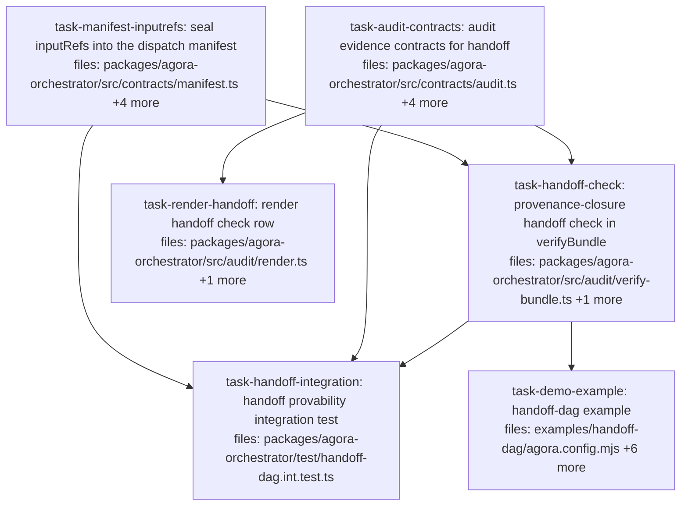

## Context

**Wave C of the typed-product handoff — provability + demo** (spec
`docs/superpowers/specs/2026-06-04-agora-typed-product-handoff-design.md` §7/§8). Authored against
fresh `main` (`01cb29a`: Waves A #39 + B #40 merged). This is the GTM payoff wave: the seal now
*proves* the handoff chain.

**The invariant being shipped (provenance closure, spec §7):**
> Every `inputRef` consumed by any item must equal a sealed output product (`resultRef`/`outputRef`)
> of another item in the same run, whose own audit chain is verified.

Refs are sha256 content hashes, so ref-equality IS byte-equality — `verifyBundle` proves "every byte a
downstream saw was produced by a verified upstream in this sealed run" without re-fetching a single
blob and without trusting the operator.

### Pinned cross-task contracts (do not drift)

1. **`DispatchManifest.inputRefs?: Record<string, string>`** (consumer side, sealed at FIRE): added to
   `BuildManifestInput` and the hashed `base` in `audit/manifest.ts`. The canonicalizer sorts keys and
   drops `undefined` (`manifest.ts:38-39`), so absence does not perturb existing hashes — proven by a
   test mirroring the existing `submittedAt` absence case (`test/audit/manifest.test.ts:80-94`).
   Producer side (`outputRefs`) does NOT go in the manifest (built at fire, before outputs exist) — it
   rides `AuditItemOutcome`.
2. **`AuditItemOutcome.outputRefs?: Record<string, string>`** — conditional-spread into the export
   items exactly like the existing `resultRef`/`manifestRef` (`orchestrator.ts:197-201`).
3. **`VerificationReport.checks.handoff: CheckResult`** semantics:
   - bare `verify()` (entry-level, no manifests available): `{ ok: 'n/a' }` — never affects `intact`.
   - `verifyBundle()` (has manifests + items): zero `inputRefs` across all manifests →
     `{ ok: true, detail: 'no handoff edges' }`; full closure → `{ ok: true, detail: '<N> input refs accounted for' }`;
     any unaccounted ref → `{ ok: false, detail: 'item <id> input <key>: <ref> not produced by any item in this run' }`
     (first offender named). `intact` in the bundle-level report requires `handoff.ok !== false`;
     the `failure` union gains a `'handoff'` literal (checked after `signature`).
4. **Producer set** = ∪ over `bundle.items` of `resultRef` plus every value of `outputRefs`. The chain
   check already covers entry integrity globally; handoff is the ref-closure check layered on top.

### Execution guards (from Waves A/B incidents — controller enforces, implementer prompts repeat)

- Implementers run ALL commands from the worktree absolute path; never the main checkout.
- Commits use the PATHSPEC form (`git commit <files> -m ...`) — immune to concurrently-staged files.
- Controller verifies every reported SHA with `git merge-base --is-ancestor` + per-commit file lists
  against the task's `files:` before accepting DONE.

### Verified ground truth this plan rides on

`executors/dispatch.ts:48-56` already computes a sanitized `inputRefs` const at fire (Wave B) — the
manifest call at `:89-98` simply doesn't receive it yet. `assembleBundle` (`audit/bundle.ts`) already
fetches manifests and runs `verify()`. No test anywhere asserts whole-object equality on
`VerificationReport.checks` (all property-wise; `cmd-verify.test.ts:246` is `toHaveProperty`) — the
additive `handoff` field breaks nothing. Setup scripts run AFTER overlay and BEFORE the adapter
(`entrypoint.ts:395-426`), so a capability-shipped `agora-setup.sh` can `git apply inputs/patch.diff`.
`examples/offload-fanout` is the demo template (live Docker path + offline fake-executor CI test).

## Tasks

## Task: seal inputRefs into the dispatch manifest

```yaml
id: task-manifest-inputrefs
depends_on: []
files:
  - packages/agora-orchestrator/src/contracts/manifest.ts
  - packages/agora-orchestrator/src/audit/manifest.ts
  - packages/agora-orchestrator/src/executors/dispatch.ts
  - packages/agora-orchestrator/test/audit/manifest.test.ts
  - packages/agora-orchestrator/test/executors/dispatch.test.ts
status: pending
```

The consumer side of the handoff lands in the sealed evidence at fire time (spec §7, pinned contract #1).
The sanitized `inputRefs` const already computed in `fire()` (dispatch.ts:48-56) threads into the
existing `buildManifest` call; the manifest type + builder gain the optional field, hash-safely.

## Implementation

```typescript
// contracts/manifest.ts — DispatchManifest gains (after secretRefs):
/** Typed-product handoff (spec §7): input key -> already-pinned agora:// URI of the
 *  upstream product this dispatch consumed. Sealed at fire; absent when the item
 *  has no needs. REFERENCES only — refs are sha256 content hashes. */
inputRefs?: Record<string, string>;

// audit/manifest.ts — BuildManifestInput gains inputRefs?: Record<string, string>;
// and `base` (:26-37) gains `inputRefs: input.inputRefs,` (canonicalizer drops undefined — hash-safe).

// executors/dispatch.ts — the buildManifest call (:89-98) gains:
//   ...(inputRefs && Object.keys(inputRefs).length ? { inputRefs } : {}),
// (the same `inputRefs` const fire() already computes at :48-56 — no recomputation)
```

```typescript
// test/audit/manifest.test.ts (mirror the existing submittedAt absence case at :80-94)
it('inputRefs is optional and its absence does not perturb the hash', () => {
  const base = { runId: 'r', itemId: 'i', executor: 'dispatch', executorManifest: {},
    secretRefs: [], actor: 'human:test', firedAt: '2026-06-05T00:00:00.000Z' };
  const without = buildManifest(base);
  const withUndefined = buildManifest({ ...base, inputRefs: undefined });
  expect(without.manifest.manifestHash).toBe(withUndefined.manifest.manifestHash);
});

it('inputRefs is sealed into the manifest and covered by the self-hash', () => {
  const refs = { patch: 'agora://ns/artifact/d/sha256:' + 'a'.repeat(64) };
  const { manifest } = buildManifest({ runId: 'r', itemId: 'i', executor: 'dispatch',
    executorManifest: {}, secretRefs: [], actor: 'human:test',
    firedAt: '2026-06-05T00:00:00.000Z', inputRefs: refs });
  expect(manifest.inputRefs).toEqual(refs);
  // different refs -> different hash (the field is INSIDE the hash)
});
```

## Acceptance criteria

- `buildManifest` with/without `inputRefs: undefined` produces IDENTICAL `manifestHash` (additive
  safety, mirroring the `submittedAt` case); two different `inputRefs` values produce different hashes.
- `DispatchExecutor.fire` on an item with `inputs.inputRefs` stores a manifest whose parsed bytes
  contain those `inputRefs` (extend the existing manifest-parsing test at `dispatch.test.ts:382-415`);
  an item without needs stores a manifest with NO `inputRefs` key.
- All existing manifest + dispatch tests pass unchanged (hash fixtures unaffected).

Test file: `packages/agora-orchestrator/test/audit/manifest.test.ts`.

## Task: audit evidence contracts for handoff

```yaml
id: task-audit-contracts
depends_on: []
files:
  - packages/agora-orchestrator/src/contracts/audit.ts
  - packages/agora-orchestrator/src/orchestrator.ts
  - packages/agora-orchestrator/src/audit/verify.ts
  - packages/agora-orchestrator/test/orchestrator-audit-export.test.ts
  - packages/agora-orchestrator/test/audit/verify.test.ts
status: pending
```

The audit-evidence record surface (pinned contracts #2/#3 types): `AuditItemOutcome` carries the
producer-side `outputRefs`, assembled into the export beside `resultRef`/`manifestRef`; the
`VerificationReport` contract gains the `handoff` check slot + `'handoff'` failure literal (consumed by
the verify/render tasks).

## Implementation

```typescript
// contracts/audit.ts — AuditItemOutcome (:56-59) gains:
/** Producer-side handoff evidence (spec §7): outputs/ deliverable refs, keyed by
 *  posix path. Refs only — content-addressed. */
outputRefs?: Record<string, string>;

// contracts/audit.ts — VerificationReport (:38-43):
//   failure?: 'chain' | 'anchor-missing' | 'root-mismatch' | 'signature' | 'handoff';
//   checks: { chain: CheckResult; root: CheckResult; signature: CheckResult; anchor: CheckResult;
//             handoff: CheckResult };

// orchestrator.ts — getAuditExport items assembly (:197-201) gains, beside manifestRef:
//   ...(i.outputRefs !== undefined ? { outputRefs: i.outputRefs } : {}),
```

```typescript
// test/orchestrator-audit-export.test.ts (extend in the file's existing style — drive a run
// via the file's harness, set refs on completion, read the export)
it('audit export items carry outputRefs when the item produced them', async () => {
  // ...existing harness: orchestrator with auditLog, submit + drive a 1-item run whose fake
  // executor reconciles done with outputRefs { 'report.txt': 'agora://ns/artifact/d/sha256:ab' }...
  const exp = /* the published AuditExport */;
  expect(exp.items.find((i) => i.id === 'a')!.outputRefs)
    .toEqual({ 'report.txt': 'agora://ns/artifact/d/sha256:ab' });
});
// plus: an item without outputRefs has NO outputRefs key on its outcome (conditional spread).
```

## Acceptance criteria

- Export items include `outputRefs` exactly when the `ItemState` has them (key absent otherwise —
  matching the `resultRef`/`manifestRef` conditional-spread style).
- `VerificationReport.checks` type includes `handoff: CheckResult` (REQUIRED) and the `failure` union
  includes `'handoff'`. Because the field is required, bare `verify()` MUST gain the
  `handoff: { ok: 'n/a' as const }` literal in its checks object (`verify.ts:43-48`) **in this task**
  — its `intact`/`failure` computations are NOT touched (`'n/a'` never affects them). Add a bare-verify
  assertion in `test/audit/verify.test.ts` in the file's property-wise style:
  `expect(r.checks.handoff.ok).toBe('n/a')`. The closure logic itself belongs to the handoff-check
  task (`verify-bundle.ts` only — this task must not touch that file).
- All existing export/audit tests pass unchanged.

Test file: `packages/agora-orchestrator/test/orchestrator-audit-export.test.ts`.

## Task: provenance-closure handoff check in verifyBundle

```yaml
id: task-handoff-check
depends_on: [task-manifest-inputrefs, task-audit-contracts]
files:
  - packages/agora-orchestrator/src/audit/verify-bundle.ts
  - packages/agora-orchestrator/test/audit/verify-bundle.test.ts
status: pending
```

The GTM check (spec §7, pinned contracts #3/#4): bare `verify()` reports `handoff: { ok: 'n/a' }`
(no manifests at entry level — never affects `intact`); `verifyBundle()` computes the provenance
closure over the bundle's manifests + items, merges it into the report, and recomputes
`intact`/`failure`/`claim` accordingly.

## Implementation

```typescript
// NOTE: verify.ts's `handoff: { ok: 'n/a' }` literal is OWNED by task-audit-contracts (already
// landed when this task runs) — this task touches verify-bundle.ts ONLY.

// audit/verify-bundle.ts — after the base verify():
export async function verifyBundle(bundle, deps): Promise<VerificationReport> {
  const base = await verify(bundle.runId, { store, anchor: deps.anchor, verifySignature: deps.verifySignature });
  const handoff = checkHandoffClosure(bundle);          // pure, local helper
  const intact = base.intact && handoff.ok !== false;
  const failure = base.failure ?? (handoff.ok === false ? ('handoff' as const) : undefined);
  // claim: recompute with the same guarantee rule verify uses, but on the new intact
  return { ...base, intact, failure, checks: { ...base.checks, handoff } };
}

/** Provenance closure (spec §7): every manifests[*].inputRefs value must equal some item's
 *  resultRef or an outputRefs value. Refs are sha256 content hashes => ref-equality IS
 *  byte-equality; no blob fetching needed. */
function checkHandoffClosure(bundle: AuditBundle): CheckResult {
  const produced = new Set<string>();
  for (const it of bundle.items) {
    if (it.resultRef) produced.add(it.resultRef);
    for (const ref of Object.values(it.outputRefs ?? {})) produced.add(ref);
  }
  let edges = 0;
  for (const m of bundle.manifests) {
    for (const [key, ref] of Object.entries(m.inputRefs ?? {})) {
      edges++;
      if (!produced.has(ref)) {
        return { ok: false, detail: `item ${m.itemId} input ${key}: ${ref} not produced by any item in this run` };
      }
    }
  }
  return edges === 0
    ? { ok: true, detail: 'no handoff edges' }
    : { ok: true, detail: `${edges} input ref${edges === 1 ? '' : 's'} accounted for` };
}
```

```typescript
// test/audit/verify-bundle.test.ts (the file's existing bundle-fixture style)
it('handoff passes when every consumed inputRef matches a sealed product', async () => {
  // bundle: item A { resultRef: REF_A }, item B; manifest for B { inputRefs: { patch: REF_A } }
  // expect report.checks.handoff to equal { ok: true, detail: '1 input ref accounted for' }
  // and report.intact to be true (given a green chain fixture)
});
it('handoff fails closed on an unaccounted input ref', async () => {
  // manifest for B { inputRefs: { patch: REF_GHOST } } with no producing item
  // expect handoff.ok false, detail naming B/patch/REF_GHOST, report.intact false, failure 'handoff'
});
it('outputRefs products satisfy the closure too', async () => {
  // item A { outputRefs: { 'data.bin': REF_O } }; manifest B { inputRefs: { data: REF_O } } -> ok true
});
```

## Acceptance criteria

- `verifyBundle`: closure over `resultRef` products passes; closure over `outputRefs` products passes;
  an unaccounted ref → `handoff.ok === false`, detail names item/key/ref, `intact === false`,
  `failure === 'handoff'` (when no earlier check failed); zero edges → `ok: true`, detail
  `'no handoff edges'`.
- A tampered chain AND a broken closure together report `failure === 'chain'` (earlier check wins —
  the existing precedence order extended).
- `claim` follows the recomputed `intact` (a handoff failure can never yield `tamper-evident`).

Test file: `packages/agora-orchestrator/test/audit/verify-bundle.test.ts`.

## Task: render handoff check row

```yaml
id: task-render-handoff
depends_on: [task-audit-contracts]
files:
  - packages/agora-orchestrator/src/audit/render.ts
  - packages/agora-orchestrator/test/audit/render.test.ts
status: pending
```

`agora verify`'s human-readable report gains the fifth check row (spec §7), after `anchor`, in the
existing row style (`render.ts:95-108`).

## Implementation

```typescript
// audit/render.ts — after the anchor row (:108):
const handoffDetail =
  r.checks.handoff.detail ?? (r.checks.handoff.ok === 'n/a' ? 'n/a' : String(r.checks.handoff.ok));
lines.push(`  ${mark(r.checks.handoff, color)} handoff      ${handoffDetail}`);
```

```typescript
// test/audit/render.test.ts (the file's greenBundle() fixture style — fixtures gain a
// handoff entry in their checks objects)
it('renders the handoff row with its detail', () => {
  const out = renderVerification(greenBundle({ handoff: { ok: true, detail: '2 input refs accounted for' } }));
  expect(out).toContain('handoff');
  expect(out).toContain('2 input refs accounted for');
});
it('marks a failed handoff with the failure glyph', () => {
  // handoff { ok: false, detail: 'item b input patch: ... not produced ...' } -> row shows the ✗ mark style
});
```

## Acceptance criteria

- Green report renders a `handoff` row after `anchor` with its detail; `'n/a'` renders as `n/a` (same
  convention as the signature row); failed handoff renders with the failure mark.
- Existing render tests pass (fixtures updated only by adding the now-required `handoff` field).

Test file: `packages/agora-orchestrator/test/audit/render.test.ts`.

## Task: handoff provability integration test

```yaml
id: task-handoff-integration
depends_on: [task-manifest-inputrefs, task-audit-contracts, task-handoff-check]
files:
  - packages/agora-orchestrator/test/handoff-dag.int.test.ts
status: pending
```

The end-to-end proof (spec §8), in the style of `test/audit/acceptance.int.test.ts` +
`test/executors/dispatch-orchestrator.int.test.ts`: a 2-item dependent run wired via `needs` drives
the REAL engine (submitRun gate → resolve-at-fire → manifests built with real `buildManifest` →
seal → export → `assembleBundle` → `verifyBundle`), ending in a passing provenance-closure report —
plus a tamper case.

## Implementation

```typescript
// test/handoff-dag.int.test.ts (NEW) — harness shape. AgoraOrchestrator + auditLog
// (createLocalSigner + LocalAnchor, exactly as acceptance.int.test.ts wires them) + a fake
// executor that mimics the dispatch executor's evidence behavior with REAL manifest bytes:
const blobs = new Map<string, Uint8Array>();
const storage = { get: async (ref: string) => { const b = blobs.get(ref); if (!b) throw new Error('missing'); return b; } };
const handoffExec = (forgeBInputRef?: string): Executor => ({
  id: 'dispatch',
  async fire(item, ctx) {
    const rawRefs = item.inputs.inputRefs as Record<string, string> | undefined;
    const inputRefs = forgeBInputRef && item.id.endsWith('b') ? { patch: forgeBInputRef } : rawRefs;
    const { manifest, bytes } = buildManifest({ runId: ctx?.runId ?? '', itemId: item.id,
      executor: 'dispatch', executorManifest: {}, secretRefs: [], actor: ctx?.actor ?? '',
      firedAt: '2026-06-05T00:00:00.000Z', ...(inputRefs ? { inputRefs } : {}) });
    const manifestRef = `agora://ns/manifest/${item.id}/${manifest.manifestHash}`;
    blobs.set(manifestRef, bytes);
    return { dispatchHash: 'd-' + item.id, manifestRef };
  },
  async reconcile(h) {
    return h === 'd-r\x1fa' || h.endsWith('a')
      ? { status: 'done' as const, resultRef: REF_A }
      : { status: 'done' as const };
  },
});
// Run: { id: 'r', items: [ A, B { needs: { patch: { from: 'a', select: { kind: 'patch' } } } } ] }
// (B has NO explicit depends_on — the real submitRun gate auto-unions it.)
```

```typescript
// The two cases (drive ticks until both done — the REAL tick resolves B's inputs.inputRefs —
// then seal the epoch, take the orchestrator's AuditExport, assembleBundle({anchor, storage}),
// verifyBundle):
it('a needs-wired run yields a bundle whose handoff check passes', async () => {
  // expect report.intact true, checks.handoff.ok true, detail '1 input ref accounted for'
  // expect the bundle's manifest for b to carry inputRefs { patch: REF_A } (sealed evidence)
});
it('a forged input ref fails the handoff check', async () => {
  // handoffExec(REF_FORGED): B's manifest seals a ref no item produced
  // expect checks.handoff.ok false, intact false, failure 'handoff'
  // while chain/root/anchor remain ok (isolating the handoff signal)
});
```

## Acceptance criteria

- Happy path: both items `done` through the real engine (real `submitRun` normalization + validation,
  real tick resolve-at-fire); the assembled bundle's manifest for B contains the sealed
  `inputRefs { patch: <A's resultRef> }`; `verifyBundle` reports `intact: true` with
  `checks.handoff.ok === true`.
- Tamper path: a manifest with a forged input ref yields `handoff.ok false`, `intact false`,
  `failure 'handoff'` — while chain/root/anchor checks still pass (isolating the handoff signal).
- The test uses real `buildManifest`/`AuditLog`/`assembleBundle`/`verifyBundle` (fake only the
  executor + storage map + anchor à la acceptance.int.test.ts) and runs offline (no Docker, CI-safe).

Test file: `packages/agora-orchestrator/test/handoff-dag.int.test.ts`.

## Task: handoff-dag example

```yaml
id: task-demo-example
depends_on: [task-handoff-check]
files:
  - examples/handoff-dag/agora.config.mjs
  - examples/handoff-dag/plan.json
  - examples/handoff-dag/src/index.ts
  - examples/handoff-dag/test/handoff.test.ts
  - examples/handoff-dag/README.md
  - examples/handoff-dag/package.json
  - CHANGELOG.md
status: pending
is_wiring_task: true
```

The operator-runnable dependent-edit demo (spec §8), cloned from the `examples/offload-fanout`
template: node A (`code-edit`) produces a patch; node B binds it via
`needs: { patch: { from: 'edit-a', select: { kind: 'patch' } } }`; B's capability ships
`agora-setup.sh` running `git apply inputs/patch.diff` (setup runs after overlay, before the adapter —
`entrypoint.ts:395-426`), so B literally *builds on the upstream edit*. The driver submits, watches to
terminal, assembles the audit bundle, and exits non-zero unless `report.intact && checks.handoff.ok`.
Live path needs Docker + `ANTHROPIC_API_KEY` (same prerequisites as offload-fanout); the CI test uses
a fake executor offline, mirroring `examples/offload-fanout/test/fanout.test.ts`. Also appends the
typed-product-handoff entry (Waves A/B/C, PRs #39/#40/this) to `CHANGELOG.md` in its existing format.

## Acceptance criteria

- `pnpm --filter handoff-dag-example test` passes offline (fake executor; no Docker/API key): drives
  the 2-item needs-wired plan to done and asserts the assembled bundle has `intact: true` and
  `checks.handoff.ok === true`.
- `plan.json` declares the dependent edit via `needs` (no hand-written `depends_on` on B — the
  submit-gate auto-union is part of what the demo shows).
- `src/index.ts` registers the subagents + an `apply-patch` capability shipping `agora-setup.sh`
  (`git apply inputs/patch.diff`), and exits 1 unless `bundle.report.intact` AND
  `bundle.report.checks.handoff.ok === true`.
- README documents: what the demo proves (downstream builds on upstream's patch, every byte
  provenance-sealed), live prerequisites (Docker, pullable worker image, ANTHROPIC_API_KEY), and the
  offline CI test — same structure as offload-fanout's README.
- `CHANGELOG.md` gains one entry for the typed-product handoff (A: outputs seam, B: input seam +
  validation, C: provenance-closure verification) in the file's existing format.
- The example's package.json registers it in the workspace exactly like offload-fanout's.

Test file: `examples/handoff-dag/test/handoff.test.ts`.
