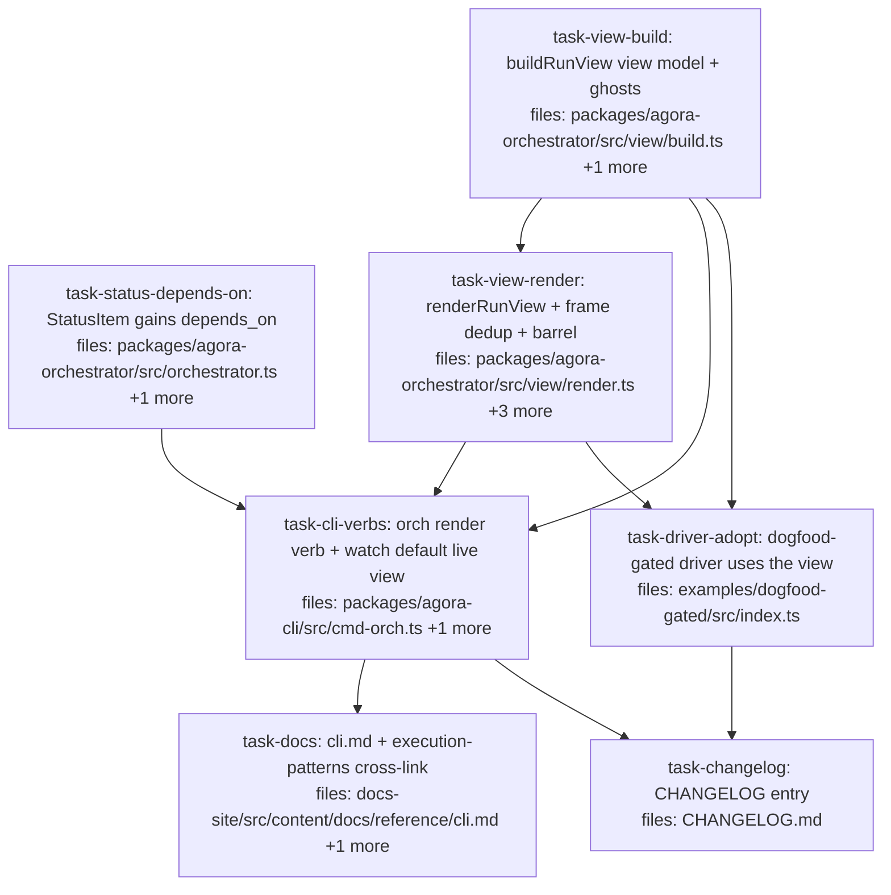

## Context

Driven by `docs/superpowers/specs/2026-06-07-agora-run-view-design.md` (audited — 6 amendments applied; READ IT, the audit-pinned details are binding). Pattern-aware CLI run view: pure `buildRunView` + `renderRunView` + pure frame-dedup in a new orchestrator `src/view/` module; `agora orch render <plan> [--pattern]` verb; `agora orch watch` default becomes the live view (`--json` = old stream, format-pinned); additive `StatusItem.depends_on`; live per-item evidence via the URI-derived-namespace sentinel recipe; dogfood-gated driver adopts the view. Everything offline-testable — zero credits.

Audit-pinned facts the tasks lean on (all verified file:line in the spec): `getStatus` already ships `{id, runId, status, blockedBy, resultRef?, manifestRef?, verify?}` (orchestrator.ts:296-309) — only `depends_on` is new; `Pattern.id` is the layout key; `parseAttempt`/`normalizeRun`/`pipeline`/`mapReduce`/`staticDag` exported from the orchestrator barrel; ghost synthesis must prune data-edge-exempt consumers (dep-resolver.ts:12-25) and follow respawnLineage's S-substitution for edges; `api.watch` yields duplicate records and can yield non-status kinds (filter `rec.kind === 'status'`); `OrchContext` has NO pattern wiring (`--pattern` is the v1 path; render must not call getOrchContext); manual-ANSI no-chalk color convention with caller-decided isTTY; glyphs `✓`/`✗` (narrow, non-emoji — never `⛩`/`✔`/`✖`); agora-cli must gain the `@quarry-systems/agora-core` dep; renderer returns `string[]` (deliberate divergence — frame loop needs line count); audit-export race at watch end → bounded retry.

Gates before PR: `pnpm -r lint`, `pnpm -r typecheck`, `pnpm -r test`, docs-site build, dogfood-gated example typecheck.

CONTROLLER PREREQUISITE (before dispatching task-cli-verbs): add `"@quarry-systems/agora-core": "workspace:*"` to packages/agora-cli/package.json dependencies and run `pnpm install` (lockfile delta confined to the new dep), committed controller-side — the implementer's scope stays inside packages/agora-cli src+test.

## Tasks

## Task: StatusItem gains depends_on

```yaml
id: task-status-depends-on
depends_on: []
files:
  - packages/agora-orchestrator/src/orchestrator.ts
  - packages/agora-orchestrator/test/orchestrator.test.ts
status: pending
model_hint: cheap
```

Additive field on the status surface (spec §2.1): `getStatus`'s item map (orchestrator.ts:296-309) adds `depends_on: i.depends_on.map(deNs)` beside the existing `blockedBy` (which stays — it is the filtered non-done list and existing consumers read it). Update the `StatusItem`-producing type at orchestrator.ts:34-38 accordingly.

## Implementation

```typescript
// packages/agora-orchestrator/src/orchestrator.ts — in the getStatus item map:
{
  id: deNs(i.id), runId, status: i.status,
  depends_on: i.depends_on.map(deNs),       // NEW — full resolved edges (tree layout)
  blockedBy: /* existing filtered list unchanged */,
  // ...existing optional fields unchanged
}
```

```typescript
// packages/agora-orchestrator/test/orchestrator.test.ts (append beside the existing blockedBy cases ~:44,159)
it('getStatus publishes full depends_on alongside blockedBy', async () => {
  // run with a done dep: blockedBy excludes it; depends_on still lists it (de-namespaced)
});
```

## Acceptance criteria

- Status items carry `depends_on` (de-namespaced, full list) for both submitted and extendRun-spawned items.
- `blockedBy` semantics unchanged; existing orchestrator/operations-api/dogfood int tests pass unmodified.
- Full orchestrator suite green.

Test file: `packages/agora-orchestrator/test/orchestrator.test.ts`.

## Task: buildRunView view model

```yaml
id: task-view-build
depends_on: []
files:
  - packages/agora-orchestrator/src/view/build.ts
  - packages/agora-orchestrator/test/view/build.test.ts
status: pending
model_hint: opus
```

The pure view-model core (spec §2.2-§2.3). `buildRunView({ plan, pattern?, status?, evidence? })` → `RunView`. Applies `pattern.plan()` THEN `normalizeRun` (mirroring submitRun; surface `plan()` throws to the caller). Layout key = `pattern?.id` (`'pipeline'`→chain, `'map-reduce'`→fan, else tree). Generations via exported `parseAttempt`. Ghost synthesis per the spec's audit-pinned rule: per gate item (`inputs.gate.onRed === 'spawn-fix'`), BFS from the gate seeding only NON-exempt direct edges (exempt = consumer has a `needs` binding `{from: gate.id, select.kind: 'output'}`), then mark every dependent of a marked item; ghosts = `<base>-fix-1` + `<gate>~2` + `~2` copies of marked items; ghost edges follow respawnLineage's substitution (lineage-internal → `~2`/fix ids; non-lineage upstreams keep original ids); one generation only. Status reconciliation: real counterpart exists → ghost becomes real; gate resolved green → ghosts dropped; gate unresolved → dotted.

## Implementation

```typescript
// packages/agora-orchestrator/src/view/build.ts (shape — types are the contract)
import type { Run, Pattern } from '../contracts/index.js';
import { normalizeRun } from '../engine/run-validator.js';
import { parseAttempt } from '../patterns/respawn.js';
import type { RuntimeUsage } from '@quarry-systems/agora-core';

export type RunViewLayout = 'chain' | 'fan' | 'tree';
export type NodeKind = 'real' | 'ghost';
export interface RunViewNode {
  id: string;
  kind: NodeKind;
  status?: string;               // absent pre-run / for ghosts
  verifyPassed?: boolean;        // from StatusItem.verify
  usage?: RuntimeUsage;
  generation: number;            // 0 = submitted; N = ~(N+1) wave
  isGate: boolean;
  depends_on: string[];          // resolved edges for layout
}
export interface RunView {
  runId: string;
  layout: RunViewLayout;
  nodes: RunViewNode[];          // stable order: plan order, then generations
  footer: { counts: Record<string, number>; costUsd: number; state: 'pre-run' | 'running' | 'terminal' };
}
export interface StatusLike { id: string; status: string; depends_on?: string[]; manifestRef?: string; verify?: { passed: boolean } }

export function buildRunView(args: { plan: Run; pattern?: Pattern; status?: StatusLike[]; evidence?: Map<string, RuntimeUsage> }): RunView;
```

```typescript
// packages/agora-orchestrator/test/view/build.test.ts (anchor case)
it('synthesizes one ghost generation under a spawn-fix gate, pruning data-edge-exempt consumers', () => {
  // plan: a -> gate(b, spawn-fix) -> c(control dep), d(needs {from: b, select:{kind:'output',path:'x'}})
  // expect ghosts: b-fix-1, b~2, c~2 — and NO d~2 (exempt); ghost c~2 depends_on [b~2]
});
```

Cover additionally: pipeline chain ordering after plan()+normalizeRun; fan layout selection; tree fallback (no pattern); ghost→real reconciliation; green collapse; bounded-red terminal state (gate~2 red ⇒ no ghost generation 3); spawned items placed via status depends_on; evidence attach; footer counts/cost/state.

## Acceptance criteria

- The anchor ghost case above exactly (exempt pruning + edge remap).
- plan()+normalizeRun applied; `plan()` throw propagates.
- Layout selection by `Pattern.id` with tree fallback.
- Pure: no I/O, deterministic; full orchestrator suite green.

Test file: `packages/agora-orchestrator/test/view/build.test.ts`.

## Task: renderRunView + frame dedup + barrel

```yaml
id: task-view-render
depends_on: [task-view-build]
files:
  - packages/agora-orchestrator/src/view/render.ts
  - packages/agora-orchestrator/src/view/frame.ts
  - packages/agora-orchestrator/src/index.ts
  - packages/agora-orchestrator/test/view/render.test.ts
status: pending
model_hint: standard
```

The pure renderer (spec §2.4) + the pure frame-dedup helper (spec §2.5) + barrel exports. Conventions from `audit/render.ts`: manual ANSI map, color boolean defaulting plain, narrow non-emoji glyphs. Returns `string[]` (deliberate divergence — callers need line count; note it in the doc comment). Glyphs: `·` pending/ready, `⟳` running, `✓` done-green, `✗` failed/done-but-red, `⊘` skipped, `┊` ghost, gate marker `▣`. ASCII mode (`unicode: false`): `[.] [>] [ok] [x] [-] [:]` + `[gate]`. Chain layout = vertical spine with respawn generations as indented forward arcs below the original; fan = splitter/fan(collapse to `× N` beyond width)/reducer with `× ?` pre-run; tree = parent-above-child with `↩ see <id>` for diamond re-references. Evidence suffix `— <level>→<model> · $<cost> · <turns>t`. Footer per RunView.footer.

## Implementation

```typescript
// packages/agora-orchestrator/src/view/render.ts
export interface RenderRunViewOpts { color: boolean; unicode: boolean; width?: number }
export function renderRunView(view: RunView, opts: RenderRunViewOpts): string[];
```

```typescript
// packages/agora-orchestrator/src/view/frame.ts — PURE dedup (no TTY code here; spec §2.5 split)
/** Returns the frame to emit, or null when identical to the previous frame. */
export function nextFrame(prev: string[] | undefined, next: string[]): string[] | null {
  if (prev && prev.length === next.length && prev.every((l, i) => l === next[i])) return null;
  return next;
}
```

```typescript
// packages/agora-orchestrator/test/view/render.test.ts (golden anchor)
it('renders the pipeline pre-run chain with a dotted ghost arc (no color, unicode)', () => {
  expect(renderRunView(view, { color: false, unicode: true })).toEqual([
    /* pixel-exact line array — authored from the actual implementation, frozen as golden */
  ]);
});
```

Goldens per spec §5: pipeline pre-run + ghost; red materialization mid-run; green collapse; bounded-red termination; map-reduce fan mid-run (+ `× ?` pre-run, `× N` collapse); tree with `↩`; exempt consumer un-ghosted; ASCII variant; no-color vs color (color frames assert containment of ANSI codes, not full pixel equality, mirroring how render.test.ts handles color today — read it first); evidence suffix on/off. Barrel: export `buildRunView`, types, `renderRunView`, `nextFrame` from `src/index.ts` (follow the existing export-section style).

## Acceptance criteria

- All goldens above; glyph set exactly as specced (no `⛩`/`✔`/`✖` anywhere).
- `nextFrame` dedup: identical → null; differing length/content → next.
- Barrel exports compile; full orchestrator suite + `pnpm --filter @quarry-systems/agora-orchestrator lint`/typecheck green.

Test file: `packages/agora-orchestrator/test/view/render.test.ts`.

## Task: CLI — render verb + watch live default

```yaml
id: task-cli-verbs
depends_on: [task-view-build, task-view-render, task-status-depends-on]
files:
  - packages/agora-cli/src/cmd-orch.ts
  - packages/agora-cli/test/cmd-orch.test.ts
status: pending
model_hint: opus
```

Both verbs (spec §3) — one task because both live in `cmd-orch.ts`. The `@quarry-systems/agora-core` dependency is pre-installed controller-side (see Context) — import it directly.

- **`orch render <plan.json> [--pattern <name>] [--no-color] [--ascii]`**: read+parse the plan; `--pattern` resolves via a local map to the exported `pipeline`/`mapReduce`/`staticDag`; omitted → no pattern (tree, no ghosts); `pattern.plan()` errors surface like `orch validate`'s. MUST NOT call `ctx.getOrchContext()` (throws without config). Print `renderRunView(buildRunView(...), { color: isTTY && !noColor, unicode: !ascii }).join('\n')`.
- **`orch watch <run-id> [--json] [--interval <ms>] [--no-color] [--no-clear] [--ascii] [--pattern <name>]`**: `--json` → EXACTLY the previous behavior (one `JSON.stringify(rec)` per yield — keep the old loop verbatim). Default → live view: filter `rec.kind === 'status'`; build view from status (+ `--pattern` for layout; tree without); best-effort evidence per item with a `manifestRef` via the URI-derived recipe (`parseAgoraUri(manifestRef)` → `{namespace, name: dispatchId}` → `buildDispatchRecordUri(namespace, dispatchId, 'output.json')` → `oc.storage.get` → `.usage`; cache per item; storage absent on the context or any throw → skip silently). Frames via `nextFrame`; default mode reprints with ANSI cursor-up by previous frame height; `--no-clear` prints only non-null frames. On terminal: final frame, then bounded retry (≤15 × 1s) for `api.audit` → print `renderVerification` summary; never-appears → one-line note, exit per run state.

## Implementation

```typescript
// packages/agora-cli/src/cmd-orch.ts (shape)
import { buildRunView, renderRunView, nextFrame, pipeline, mapReduce, staticDag, renderVerification } from '@quarry-systems/agora-orchestrator';
import { parseAgoraUri, buildDispatchRecordUri } from '@quarry-systems/agora-core';
const PATTERNS: Record<string, Pattern> = { pipeline, 'map-reduce': mapReduce, 'static-dag': staticDag };
```

```typescript
// packages/agora-cli/test/cmd-orch.test.ts (anchors; follow the file's makeFakeTransport/makeCtx/captureLog harness)
it('watch --json preserves the raw stream format', async () => { /* pre-publish terminal status; assert one JSON.parse-able line per yield matching the old shape */ });
it('watch renders frames and dedups identical polls', async () => { /* transport whose readOutbox advances: status A, A, B, terminal; --interval 0 --no-clear; assert frame count = distinct frames */ });
it('render --pattern pipeline shows the ghost arc for a spawn-fix gate plan', async () => { /* plan fixture file via tmp; assert ghost lines present */ });
```

## Acceptance criteria

- `--json` format pin green (the old loop, untouched semantics).
- Default watch: kind-filter proven (a non-status record before first status does not crash/render); frame dedup proven; evidence best-effort proven (storage absent → frames still render).
- `render` works with NO config file in cwd (test runs in a bare tmp cwd).
- Terminal verify-summary retry path covered (audit publishes late → summary still prints; never → note).
- Full agora-cli suite green.

Test file: `packages/agora-cli/test/cmd-orch.test.ts`.

## Task: dogfood-gated driver adopts the view

```yaml
id: task-driver-adopt
depends_on: [task-view-build, task-view-render]
files:
  - examples/dogfood-gated/src/index.ts
status: pending
model_hint: standard
```

Replace the driver's flat watch loop (index.ts:247-254 region) with the shared view (spec §4): per status record, `buildRunView({ plan, pattern: pipeline, status, evidence })` → `renderRunView` (no-color — driver output is a log) → `nextFrame` dedup → print non-null frames (append mode; no cursor control). Evidence reuses the driver's existing `readUsage` (called best-effort per reconciled item, cached). EVERYTHING ELSE UNCHANGED: the four §4 acceptance rows, the evidence table, patch download, proof persistence — those are the assertion surface; this task touches presentation only.

## Implementation

```typescript
// examples/dogfood-gated/src/index.ts — watch loop becomes:
let prevFrame: string[] | undefined;
const usageCache = new Map<string, RuntimeUsage>();
for await (const rec of api.watch(runId, { intervalMs: 3_000, signal: watchAc.signal })) {
  if (rec.kind !== 'status' || !Array.isArray(rec.body)) continue;
  const status = rec.body as StatusLike[];
  for (const it of status) if (it.manifestRef && it.status === 'done' && !usageCache.has(it.id)) {
    const u = await readUsage(it.manifestRef); if (u) usageCache.set(it.id, u);
  }
  const frame = nextFrame(prevFrame, renderRunView(buildRunView({ plan, pattern: pipeline, status, evidence: usageCache }), { color: false, unicode: true }));
  if (frame) { console.log(frame.join('\n')); prevFrame = frame; }
}
```

```typescript
// verification: pnpm typecheck (the example's gate; no live run in CI — run-2 convention)
```

## Acceptance criteria

- Watch loop replaced; flat per-item println spam gone; frames only on change.
- All acceptance-row logic, evidence table, patch download, proof persistence byte-unchanged (diff confined to the watch loop + imports).
- `pnpm typecheck` green in examples/dogfood-gated/.

Test file: n/a (typecheck is the gate; the next live run validates visually).

## Task: docs — cli reference + cross-link

```yaml
id: task-docs
depends_on: [task-cli-verbs]
files:
  - docs-site/src/content/docs/reference/cli.md
  - docs-site/src/content/docs/explanation/execution-patterns.md
status: pending
model_hint: standard
is_wiring_task: true
```

Document the LANDED verbs (claims code-verified — read the merged cmd-orch.ts first): `orch render` (flags, the `--pattern` requirement for non-tree layouts, no-config operation), `orch watch`'s new default + `--json` migration note + flags. One cross-link in execution-patterns.md ("watch a pattern run live: `agora orch watch`"). docs-site build + links validator green.

## Acceptance criteria

- Every claim matches landed code (flags, defaults, glyph examples if shown).
- `pnpm build` in docs-site/ green incl. links validator.

Test file: n/a (site build is the gate).

## Task: CHANGELOG entry

```yaml
id: task-changelog
depends_on: [task-cli-verbs, task-driver-adopt]
files:
  - CHANGELOG.md
status: pending
model_hint: cheap
is_wiring_task: true
```

One entry, established format: the pattern-aware run view (`orch render`, `watch` live default with `--json` migration note), the additive `StatusItem.depends_on`, driver adoption. Cite the spec path. No claims beyond what landed.

## Acceptance criteria

- Matches existing format; names all surfaces incl. the watch-default migration note; cites the spec.

Test file: n/a.
